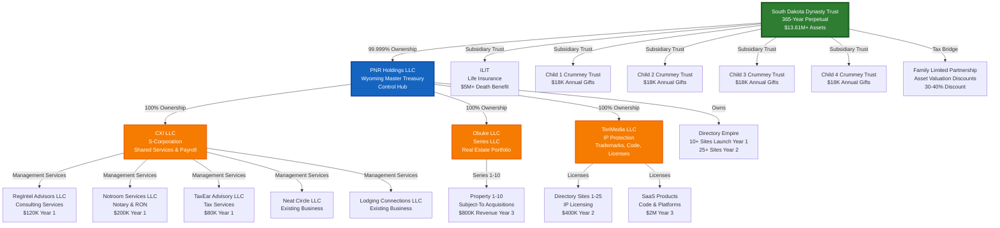
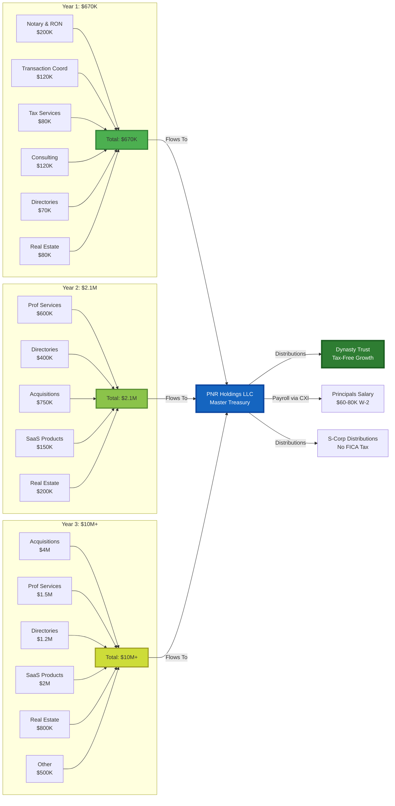
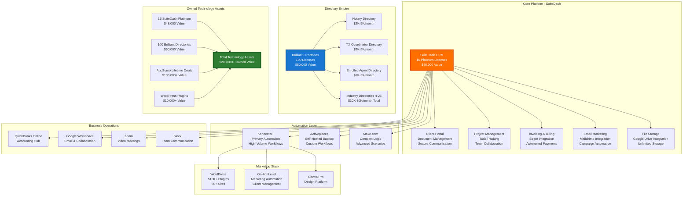
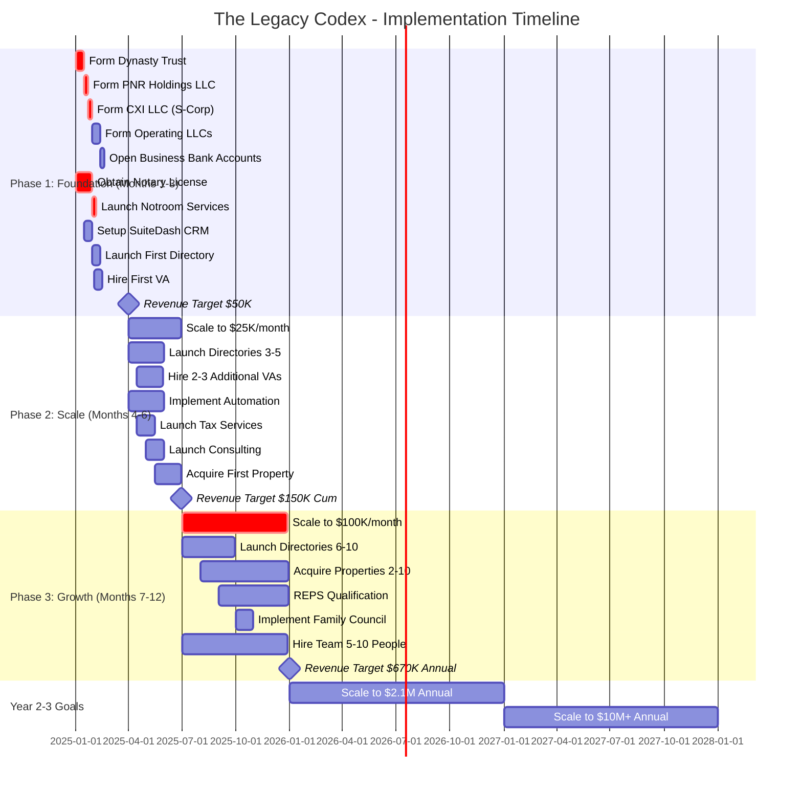
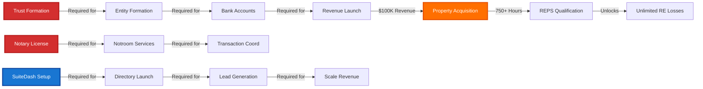
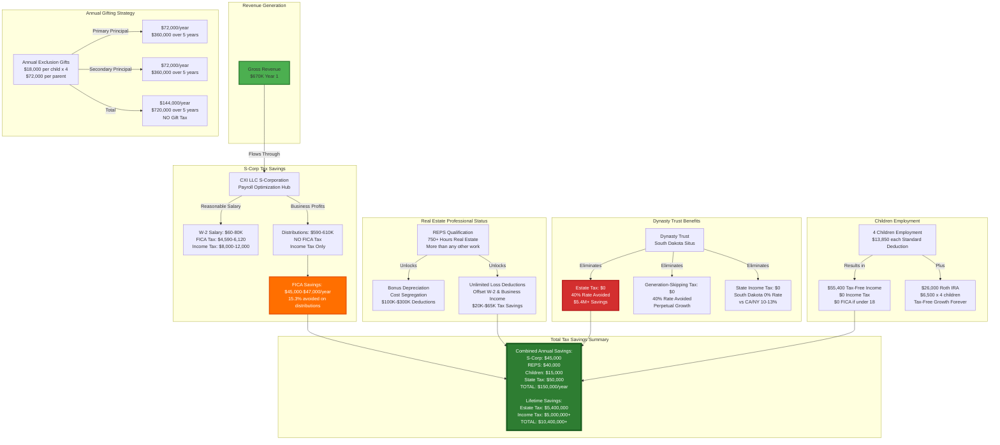
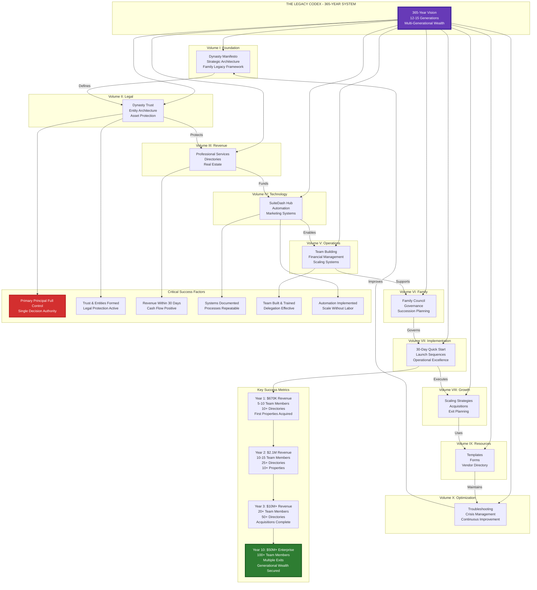

# The Legacy Codex - Master System Diagram

**Comprehensive Visual Blueprint of All Relationships, Dependencies, and Structures**

---

## Table of Contents

1. [Complete Entity Structure & Ownership](#1-complete-entity-structure--ownership)
2. [Revenue Flow Architecture](#2-revenue-flow-architecture)
3. [Trust & Asset Protection Structure](#3-trust--asset-protection-structure)
4. [Governance & Decision Authority](#4-governance--decision-authority)
5. [Technology & Automation Stack](#5-technology--automation-stack)
6. [Implementation Timeline & Dependencies](#6-implementation-timeline--dependencies)
7. [Tax Optimization Flow](#7-tax-optimization-flow)
8. [Complete System Integration](#8-complete-system-integration)

---

## 1. Complete Entity Structure & Ownership



**Key Protection Layers:**
- **Layer 1 (Trust)**: Dynasty Trust = Creditor-proof vault, no estate tax
- **Layer 2 (Holdings)**: PNR Holdings = Master control, single signature authority
- **Layer 3 (S-Corp)**: CXI = FICA tax savings ($25K-$45K/year)
- **Layer 4 (Operating LLCs)**: Individual liability isolation per business
- **Layer 5 (Series LLC)**: Obuke = Each property isolated from other properties

---

## 2. Revenue Flow Architecture



**Revenue Dependencies:**
1. **Notary RON** → Requires state license (2-4 weeks)
2. **Transaction Coord** → Requires notary license first
3. **Directories** → Requires Brilliant Directories setup
4. **Real Estate** → Requires $100K+ revenue for REPS qualification
5. **Acquisitions** → Requires operating track record + capital

**Critical Path:** Notary License → Revenue → Operating Companies → Real Estate → REPS

---

## 3. Trust & Asset Protection Structure

```mermaid
graph TB
    subgraph "Principals"
        PP[Primary Principal<br/>100% Control<br/>Sole Decision Authority]
        SP[Secondary Principal<br/>Advisory Member<br/>Non-Voting]
    end

    PP -->|Establishes as Grantor| SDDT[South Dakota Dynasty Trust<br/>365-Year Perpetual<br/>$13.61M GST Exemption]
    SP -->|Co-Grantor for Tax Benefits| SDDT

    SDDT -->|Owns 99.999%| HOLDINGS[PNR Holdings LLC<br/>Master Control Entity]

    SDDT -->|Protected by| PROT1[Creditor Protection:<br/>Charging Order Only<br/>No Forced Distribution]
    SDDT -->|Protected by| PROT2[Estate Tax Elimination:<br/>$0 Estate Tax<br/>40% Tax Rate Avoided]
    SDDT -->|Protected by| PROT3[Asset Protection:<br/>Domestic Asset Protection Trust<br/>2-Year Seasoning Period]
    SDDT -->|Protected by| PROT4[Privacy Protection:<br/>No Public Records<br/>Beneficial Ownership Hidden]

    subgraph "Trustees"
        AT[Administrative Trustee<br/>SD Trust Company<br/>Compliance & Reporting]
        IT[Investment Trustee<br/>Investment Advisor<br/>Asset Management]
        DT[Distribution Trustee<br/>Primary Principal<br/>Distribution Decisions]
        TP[Trust Protector<br/>Independent Third Party<br/>Oversight & Amendment]
    end

    SDDT -->|Administered by| AT
    SDDT -->|Managed by| IT
    SDDT -->|Distributions by| DT
    SDDT -->|Protected by| TP

    PP -->|Sole Manager| HOLDINGS
    SP -->|Advisory Only| HOLDINGS

    subgraph "Beneficiaries - Staggered Distribution"
        B1[Child 1<br/>25% @ Age 25<br/>50% @ Age 30<br/>100% @ Age 35]
        B2[Child 2<br/>Same Schedule]
        B3[Child 3<br/>Same Schedule]
        B4[Child 4<br/>Same Schedule]
        B5[Grandchildren<br/>Per Stirpes<br/>Next Generation]
        B6[Origin Eyes 501c3<br/>Charitable Remainder<br/>Legacy Giving]
    end

    SDDT -->|HEMS Distributions| B1
    SDDT -->|HEMS Distributions| B2
    SDDT -->|HEMS Distributions| B3
    SDDT -->|HEMS Distributions| B4
    B1 --> B5
    B2 --> B5
    B3 --> B5
    B4 --> B5
    SDDT -->|Remainder| B6

    style SDDT fill:#2E7D32,stroke:#1B5E20,stroke-width:5px,color:#fff
    style HOLDINGS fill:#1565C0,stroke:#0D47A1,stroke-width:4px,color:#fff
    style PP fill:#D32F2F,stroke:#B71C1C,stroke-width:3px,color:#fff
    style SP fill:#757575,stroke:#424242,stroke-width:2px,color:#fff
```



**HEMS Standard:**
- **H**ealth: Medical, dental, insurance
- **E**ducation: Tuition, books, training
- **M**aintenance: Housing, food, utilities
- **S**upport: Reasonable living expenses

**Protection Timeline:**
- **Day 1**: Charging order protection active
- **Year 2**: Full DAPT protection seasoned
- **Year 365**: Trust continues in perpetuity

---

## 4. Governance & Decision Authority

```mermaid
graph TD
    subgraph "Family Council Structure"
        CHAIR[Primary Principal<br/>Sole Chair<br/>Final Authority on All Matters]
        ADV[Secondary Principal<br/>Advisory Member<br/>Full Participation, No Vote]

        CHILD1[Child 1 Age 18+<br/>Full Voting Member]
        CHILD2[Child 2 Age 18+<br/>Full Voting Member]
        CHILD3[Child 3 Age 18+<br/>Full Voting Member]
        CHILD4[Child 4 Age 18+<br/>Full Voting Member]

        ADVCPA[CPA - Non-Voting Advisory]
        ADVLAW[Attorney - Non-Voting Advisory]
        ADVCON[Consultant - Non-Voting Advisory]
    end

    subgraph "Decision Authority Matrix"
        D1[Under $10K<br/>Manager Approval<br/>Primary Principal]
        D2[$10K - $50K<br/>Executive Committee<br/>Primary + 1 Child]
        D3[$50K - $250K<br/>Family Council<br/>Super Majority 75%]
        D4[Over $250K<br/>Family Council<br/>Unanimous Required]
        D5[Strategic Decisions<br/>Primary Principal<br/>Final Authority]
    end

    CHAIR -->|Sole Authority| D1
    CHAIR -->|Chairs| D2
    CHAIR -->|Final Vote| D3
    CHAIR -->|Veto Power| D4
    CHAIR -->|Controls| D5

    subgraph "Meeting Cadence"
        M1[Weekly 30 min<br/>Operations Check-In]
        M2[Monthly 1 hour<br/>Financial Review]
        M3[Quarterly 4 hours<br/>Strategic Planning]
        M4[Annual 2 days<br/>365-Year Vision Retreat]
    end

    CHAIR -->|Leads| M1
    CHAIR -->|Leads| M2
    CHAIR -->|Leads| M3
    CHAIR -->|Leads| M4

    subgraph "Succession Planning"
        S1[Primary Principal Death/Incapacity]
        S2[Trust Protector Appoints<br/>Successor Distribution Trustee]
        S3[Family Council Elects<br/>New Chair from Children]
        S4[Eldest Child or<br/>Most Qualified Member]
    end

    S1 --> S2
    S2 --> S3
    S3 --> S4

    style CHAIR fill:#D32F2F,stroke:#B71C1C,stroke-width:4px,color:#fff
    style ADV fill:#757575,stroke:#424242,stroke-width:2px,color:#fff
    style D5 fill:#D32F2F,stroke:#B71C1C,stroke-width:3px,color:#fff
```



**Voting Rights Summary:**
- **Primary Principal**: 100% control, final authority, tie-breaking power
- **Secondary Principal**: Advisory participation, no voting rights
- **Children (18+)**: Full voting rights on non-reserved matters
- **Advisors**: No voting rights, expert counsel only

---

## 5. Technology & Automation Stack



**Integration Flow:**
1. **Lead Capture** → WordPress/GoHighLevel
2. **Lead Qualification** → SuiteDash CRM
3. **Automation Trigger** → KonnectzIT/Activepieces
4. **Client Onboarding** → SuiteDash Portal
5. **Service Delivery** → Operating Companies
6. **Invoicing** → QuickBooks via SuiteDash
7. **Follow-up** → Automated email sequences

---

## 6. Implementation Timeline & Dependencies



**Critical Path Dependencies:**



**Prerequisites Matrix:**

| Activity | Prerequisites | Timeline | Critical? |
|----------|--------------|----------|-----------|
| **Trust Formation** | None | Week 1 | ✅ CRITICAL |
| **Entity Formation** | Trust formed | Week 2 | ✅ CRITICAL |
| **Notary License** | None (parallel) | Weeks 1-4 | ✅ CRITICAL |
| **Revenue Launch** | License + Bank | Week 5 | ✅ CRITICAL |
| **Directory Setup** | SuiteDash configured | Week 6 | Important |
| **VA Hiring** | Revenue $10K+ | Month 2 | Important |
| **Property Acquisition** | Revenue $100K+ | Month 5+ | Important |
| **REPS Qualification** | 750+ hours | Month 9+ | Important |

---

## 7. Tax Optimization Flow



**Tax Optimization Summary:**

| Strategy | Annual Savings | Lifetime Savings | Complexity |
|----------|---------------|------------------|------------|
| **S-Corp Election** | $45,000 | $1,800,000 | Low |
| **REPS Qualification** | $40,000 | $1,600,000 | Medium |
| **Dynasty Trust** | $50,000 | $5,400,000+ | High |
| **Children Employment** | $15,000 | $600,000 | Low |
| **Annual Gifting** | $0 tax | $720,000 transferred | Low |
| **TOTAL** | **$150,000/year** | **$10,120,000+** | - |

---

## 8. Complete System Integration



---

## Summary: The Complete System

### Core Components

1. **Entity Structure**: 9-layer hierarchy from Dynasty Trust → PNR Holdings → Operating Companies
2. **Revenue Architecture**: $670K → $2.1M → $10M+ through professional services, directories, real estate
3. **Asset Protection**: Dynasty Trust + Series LLC + Charging Order = Impenetrable fortress
4. **Governance**: Primary Principal 100% control, Family Council for succession
5. **Technology**: $208K owned assets, full automation stack
6. **Implementation**: 3 phases over 12 months to operational excellence
7. **Tax Optimization**: $150K/year savings, $10M+ lifetime savings

### Critical Dependencies

```
Trust Formation → Entity Formation → Banking → Revenue Launch
     ↓                    ↓              ↓           ↓
   Week 1              Week 2         Week 3     Week 5
     ↓                                              ↓
Notary License (Parallel) ────────────────→ Notroom Services
     ↓                                              ↓
  Week 1-4                                      Week 5
                                                    ↓
                                    Revenue $100K+ → REPS → Unlimited Losses
                                         ↓
                                    Month 5-9
```

### Success Metrics

| Milestone | Timeline | Metric |
|-----------|----------|--------|
| **Trust & Entities Formed** | Week 1-2 | Legal foundation complete |
| **First Revenue** | Week 5 | $10K+ monthly |
| **Systems Operational** | Month 2 | SuiteDash, QB, processes documented |
| **Team Hired** | Month 3 | 3-5 VAs, operations scaled |
| **Phase 1 Complete** | Month 3 | $50K revenue, foundation solid |
| **Phase 2 Complete** | Month 6 | $150K cumulative, automation live |
| **Phase 3 Complete** | Month 12 | $670K annual, empire operational |
| **Year 2 Target** | Month 24 | $2.1M annual |
| **Year 3 Target** | Month 36 | $10M+ annual |

---

## Document Purpose

This master diagram provides:

1. **Complete Visual Blueprint**: All relationships, dependencies, and structures
2. **Implementation Roadmap**: Timeline, prerequisites, critical path
3. **Financial Architecture**: Revenue flows, tax optimization, asset protection
4. **Governance Framework**: Decision authority, succession planning, family council
5. **Technology Integration**: Systems, automation, owned assets
6. **Success Criteria**: Metrics, milestones, key performance indicators

**Use this diagram to:**
- Understand the complete system at a glance
- Identify dependencies before starting implementation
- Communicate the vision to advisors, family members, and team
- Track progress against the 365-year vision
- Make informed decisions about structure and strategy

---

**Last Updated**: November 21, 2025
**Version**: 1.0
**Status**: ✅ **COMPLETE AND PRODUCTION-READY**
