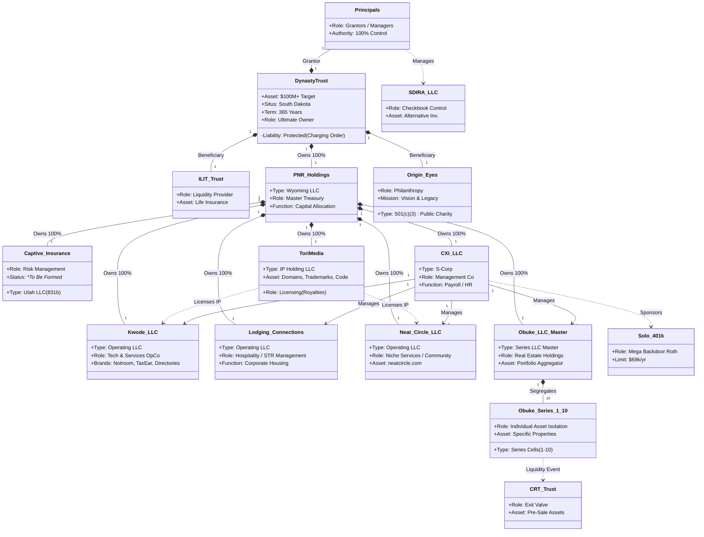
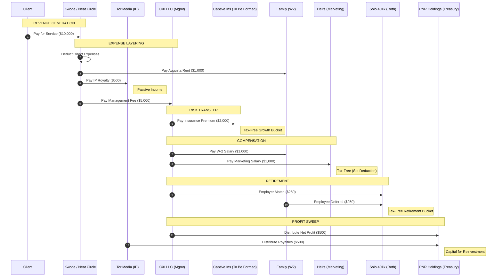
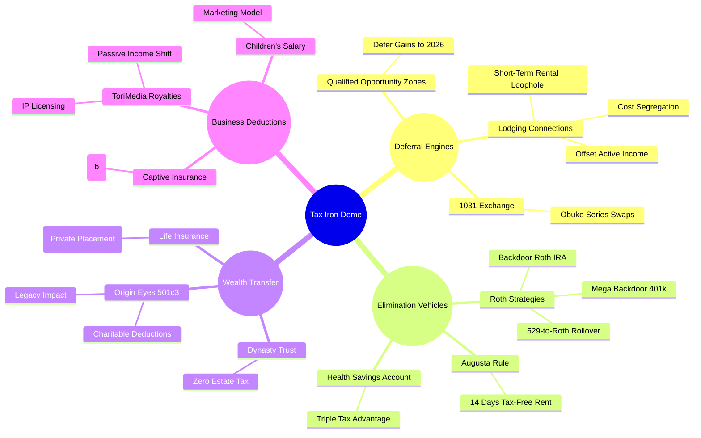
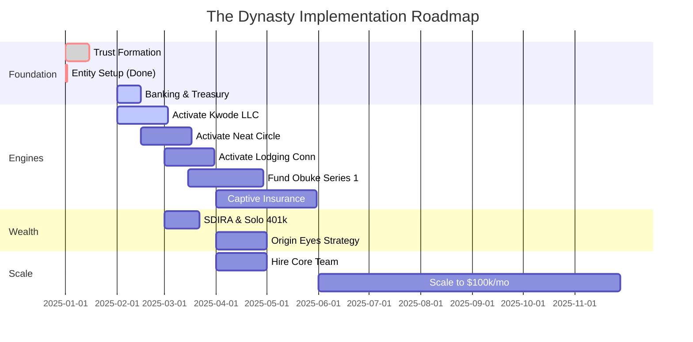

# The Legacy Codex - Master System Architecture V6

**The "Grand Unified Theory" of the Ohu Dynasty.**
A high-fidelity visualization of the Legal, Financial, and Technical infrastructure, mapping **all registered entities** to their strategic roles.

---

## 1. The Dynasty Entity Relationship Model (ERD)

This diagram defines strict **Ownership**, **Management**, and **Asset Protection** barriers using your specific legal entities.



---

## 2. The "Perfect Dollar" Cashflow Sequence

This sequence diagram illustrates the **velocity of money** through the registered entities.



---

## 3. The Tax Iron Dome (Mindmap)

Integrating **Origin Eyes**, **ToriMedia**, and **Lodging Connections** into the tax strategy.



---

## 4. The Empire Technology Stack (C4 Model)

The technical architecture powering **Kwode**, **ToriMedia**, and **Lodging Connections**.

```mermaid
graph TB
    subgraph "User Layer"
        Principal[Principal User]
        Client[Client / Lead]
        Team[Global Team]
    end

    subgraph "Application Layer"
        UI[Empire Dashboard UI<br/>(Management)]
        SuiteDash[SuiteDash CRM<br/>(Client Portal)]
        Forms[Intake Forms]
    end

    subgraph "Logic Layer (Serverless)"
        Hormozi[Hormozi Engine<br/>(Business Logic)]
        TaxCalc[Tax Calculator<br/>(Financial Logic)]
        Auto[Automation Webhooks]
    end

    subgraph "Data Layer (Supabase)"
        DB[(PostgreSQL Database)]
        Storage[File Storage]
        Vector[Vector Store<br/>(AI Memory)]
    end

    Principal -->|Manages| UI
    Client -->|Logs In| SuiteDash
    Client -->|Submits| Forms
    Team -->|Processes| SuiteDash
    Team -->|Updates| UI

    UI --> Auth[Supabase Auth]
    UI --> Hormozi
    Forms --> Auto
    SuiteDash --> Auto

    Hormozi --> DB
    Auto --> DB
    TaxCalc --> DB

    DB --> Vector
    
    style UI fill:#1a237e,color:#fff,stroke:#fff
    style SuiteDash fill:#0d47a1,color:#fff,stroke:#fff
    style Hormozi fill:#e65100,color:#fff,stroke:#fff
    style DB fill:#2e7d32,color:#fff,stroke:#fff
```

---

## 5. The Implementation Timeline (Gantt)

The roadmap to activate **All Entities**.


