# LEGACY CODEX: MASTER VISUALIZATION ARCHITECTURE
## Version 2.1

This document serves as the "Visual Source Code" for the Ohu Dynasty's structure. It uses **Mermaid.js** and **PlantUML** syntax to render live diagrams of the legal, financial, operational, and governance architecture.

---

## 1. Master Entity Map (Component Diagram)

This diagram visualizes the relationship between the Trust, the Holding Company, and the Operating Entities, including tax classifications.

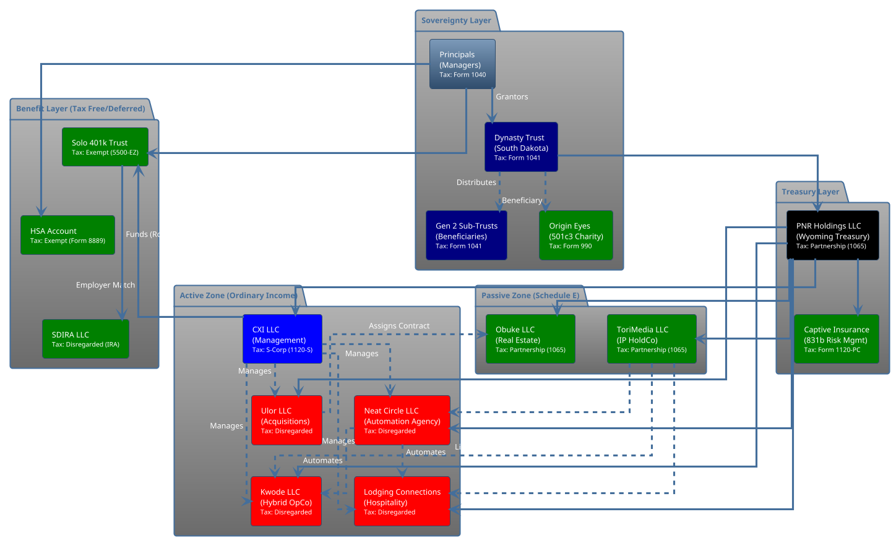

---

## 2. The "Perfect Dollar" Sequence

This sequence diagram tracks the flow of $1 of revenue from a client through the entire system, maximizing tax efficiency and asset protection.

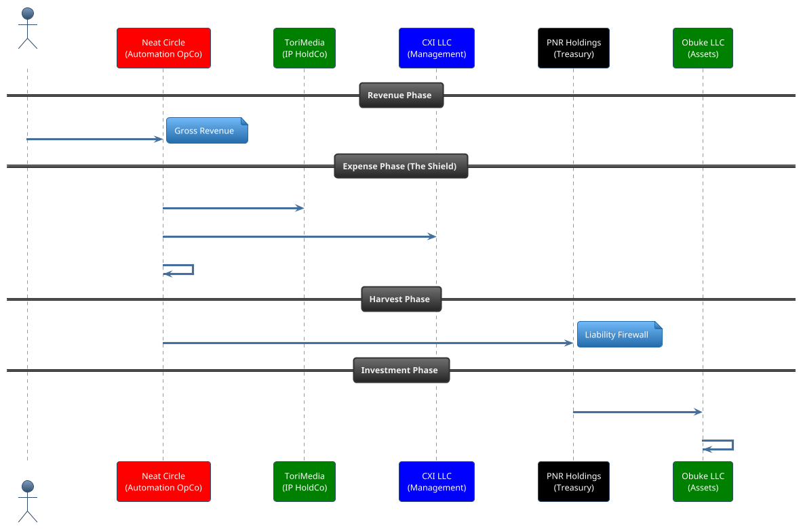

---

## 3. The "Tax Iron Dome" Mindmap

A visual breakdown of the tax mitigation strategies employed by the Codex.

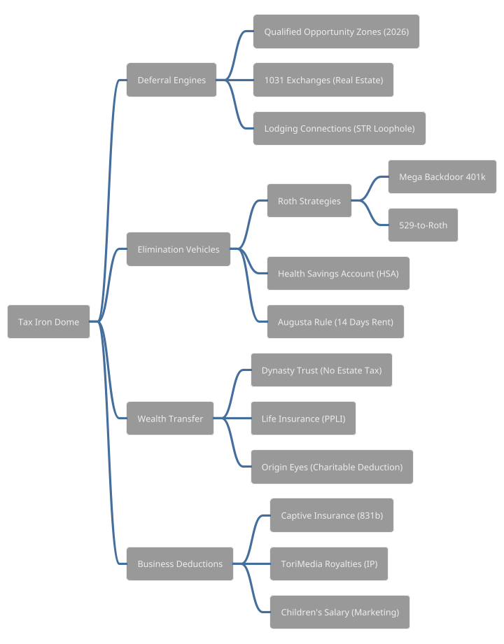

---

## 4. The "North Star" Tech Stack Architecture

This diagram visualizes the "Big 6" tools ecosystem and how they interconnect, centered around SuiteDash.

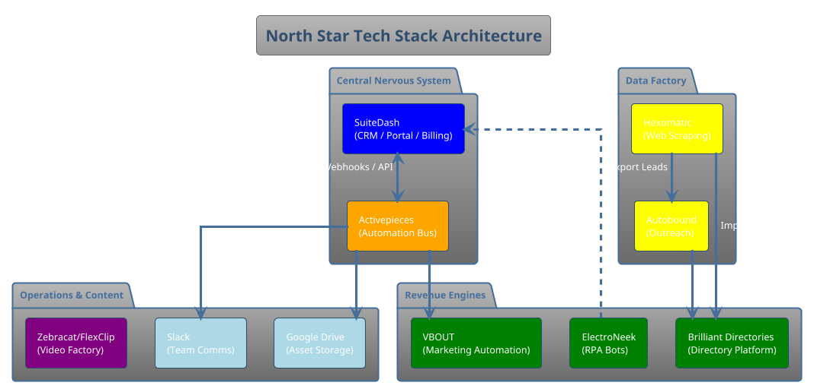

---

## 5. The Directory Data Factory Pipeline

This diagram maps the automated workflow for scraping data, populating directories, and acquiring members.

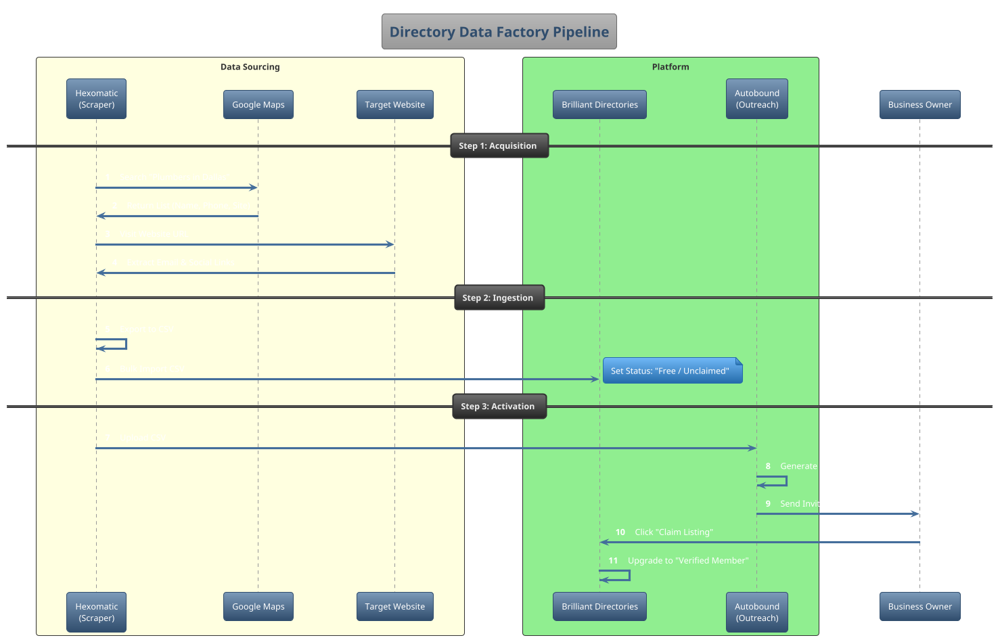

---

## 6. The Automation Agency Data Flow

This sequence diagram details the "Recipe 1" workflow for instant client onboarding.

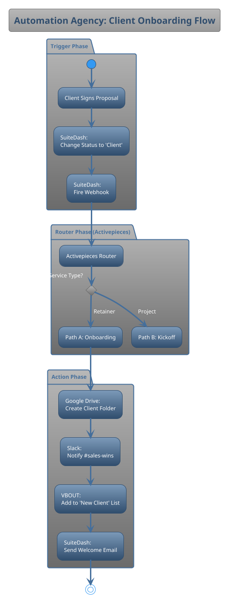

---

## 7. The "Legacy Bridge" RPA Logic

This activity diagram shows how ElectroNeek bots modernize legacy businesses.

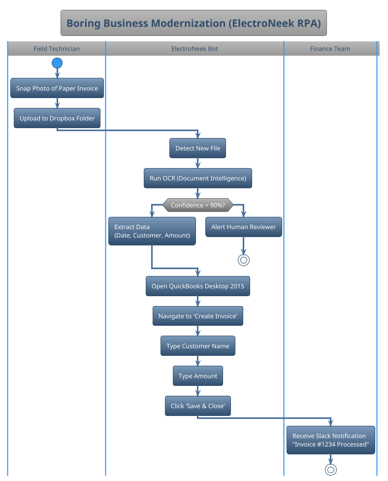

---

## 8. The "CLOSER" Sales Pipeline & Value Engine

This state diagram visualizes the 7-stage sales process and the "Hormozi Value" automation logic.

```plantuml
@startuml
!theme spacelab
title "CLOSER Sales Pipeline & Value Engine"

state "Lead Entry" as ENTRY
state "Hormozi Value Calculation" as CALC
state "1. CLARIFY" as S1
state "2. LABEL" as S2
state "3. OVERVIEW" as S3
state "4. SELL" as S4
state "5. EXPLAIN" as S5
state "6. REINFORCE" as S6
state "7. CLOSED" as S7

ENTRY --> CALC : Lead Created/Updated
CALC : Calculate Score: (Dream * Belief) / (Delay * Effort)
CALC --> S1 : Score > 50
CALC --> "Nurture List" : Score < 50

S1 : Goal: Identify Pain
S1 : Auto: Send Pre-Discovery Email
S1 --> S2 : Pain Identified

S2 : Goal: Confirm Problem Label
S2 --> S3 : Problem Agreed

S3 : Goal: Document Past Failures
S3 --> S4 : Failures Logged

S4 : Goal: Demo Solution
S4 : Update: Time_Delay (Speed)
S4 --> S5 : Demo Complete

S5 : Goal: Handle Objections
S5 : Update: Effort_Score (Ease)
S5 --> S6 : Objections Cleared

S6 : Goal: Contract
S6 : Auto: Generate Proposal
S6 --> S7 : Signed & Paid

S7 : Goal: Onboarding
S7 --> [*]
@enduml
```

---

## 9. The Content Repurposing Waterfall

This diagram visualizes the organic marketing machine and content distribution workflow.

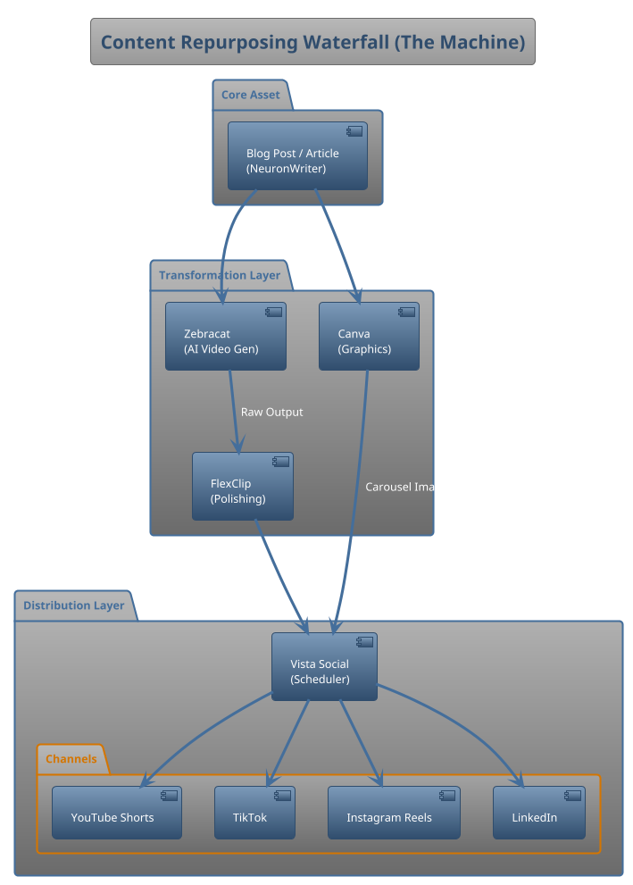

---

## 10. Operational Workflows (Specific Entities)

These diagrams cover the specific day-to-day operations of the primary cash-flow businesses.

### 10.1 Notroom Services: Premium Mobile Notary Flow

Visualizes the "concierge" service model that commands premium pricing.

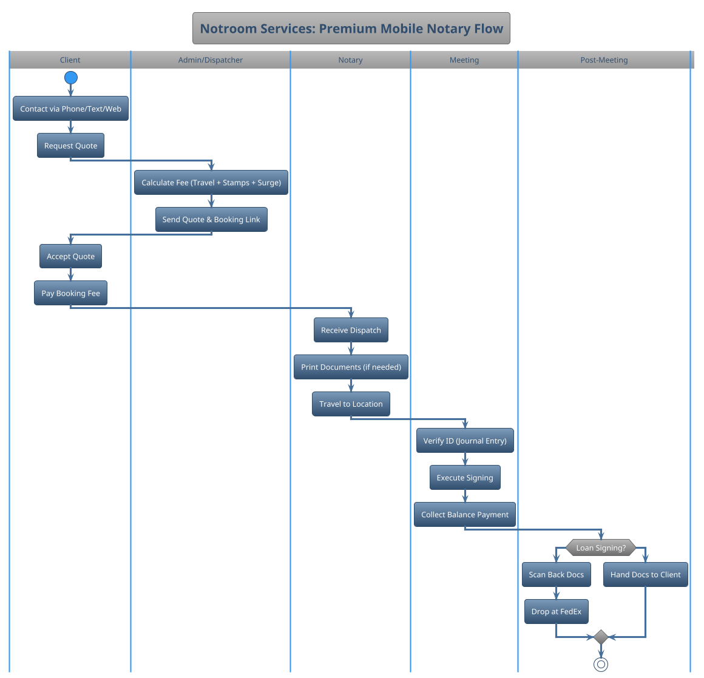

### 10.2 Obuke Real Estate: Subject-To Transaction

Visualizes the exact mechanics of acquiring a property "Subject-To" the existing mortgage.

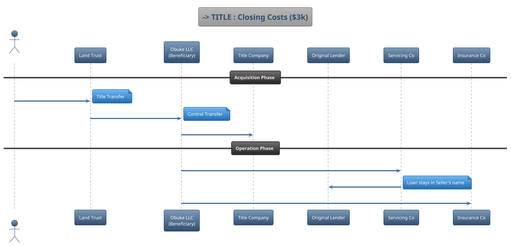

### 10.3 M&A: The First 100 Days Timeline

A Gantt chart visualizing the critical stabilization and modernization phase after buying a business.

```plantuml
@startuml
!theme spacelab
title "M&A: The First 100 Days"
printscale weekly zoom 2

project starts the 2025-01-01

[Day 1: Takeover] happens 2025-01-01
[Town Hall Meeting] happens 2025-01-01
[Bank Control Switch] happens 2025-01-01

-- Phase 1: Stabilization --
[Financial Controls] starts 2025-01-02 and lasts 7 days
[Employee Interviews] starts 2025-01-08 and lasts 7 days
[Process Documentation] starts 2025-01-08 and lasts 14 days

-- Phase 2: Modernization --
[SuiteDash Migration] starts 2025-02-01 and lasts 14 days
[Brand Refresh] starts 2025-02-15 and lasts 14 days
[Pricing Optimization] starts 2025-03-01 and lasts 7 days

-- Phase 3: Optimization --
[SOP Deployment] starts 2025-03-08 and lasts 14 days
[Automation Integration] starts 2025-03-22 and lasts 14 days
[KPIs & Bonuses] starts 2025-04-05 and lasts 7 days

@enduml
```

---

## 11. Governance & Succession Workflows

These diagrams visualize the decision-making structures and generational transfer protocols described in Volume VI.

### 11.1 Family Council Decision Escalation Protocol

This flowchart illustrates how decisions move from operational managers up to the Family Council based on financial impact and strategic importance.

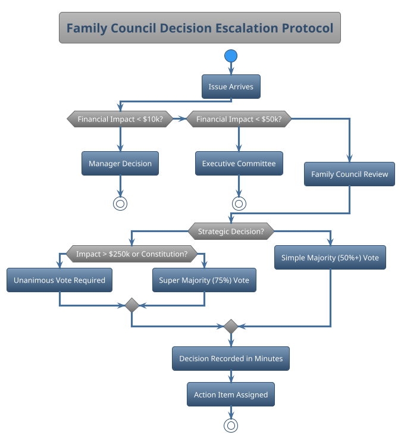

### 11.2 Generational Succession Timeline

A 20-year roadmap for transitioning leadership to the next generation, ensuring adequate preparation and overlapping co-leadership.

```plantuml
@startuml
!theme spacelab
title "Generational Succession Timeline (20-Year Horizon)"
printscale yearly

project starts the 2025-01-01

[Phase 1: Preparation] starts 2025-01-01 and lasts 5 years
[Successor ID] starts 2025-01-01 and lasts 2 years
[Initial Training] starts 2027-01-01 and lasts 3 years

[Phase 2: Integration] starts 2030-01-01 and lasts 5 years
[Department Leadership] starts 2030-01-01 and lasts 3 years
[Strategic Involvement] starts 2033-01-01 and lasts 2 years

[Phase 3: Co-Leadership] starts 2035-01-01 and lasts 3 years
[Joint Decisions] starts 2035-01-01 and lasts 3 years

[Phase 4: Transition] starts 2038-01-01 and lasts 1 years
[Formal Handoff] happens 2038-06-01

[Phase 5: Advisory] starts 2039-01-01 and lasts 5 years

@enduml
```

### 11.3 Emergency Succession Response Protocol

The "Break Glass in Case of Emergency" workflow for handling unexpected leadership vacuums (death or incapacity).

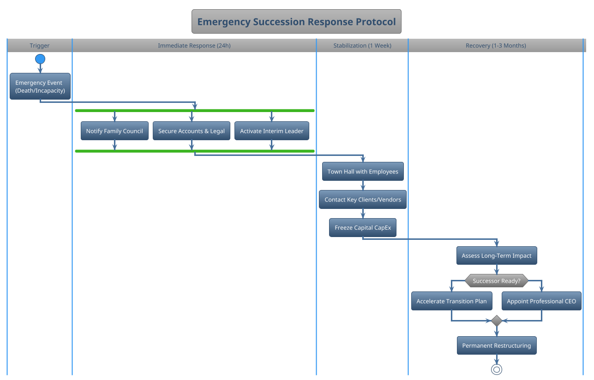

---

## 12. PlantUML Alternatives (Advanced Visualization)

For users preferring Graphviz/PlantUML layout control, here are the source codes for the primary legal/financial diagrams.

### 12.1 Master Entity Map (Component Diagram)

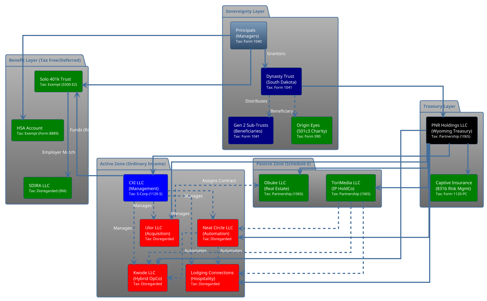

### 12.2 The Perfect Dollar Sequence


### 12.3 The Tax Iron Dome (Mindmap)


## 13. Operational Cash Flow Architecture ("Profit First" Engine)

This diagram illustrates the **Daily Banking Rhythm** described in Volume V. It ensures profit is taken *first*, taxes are reserved immediately, and operations run only on what remains.

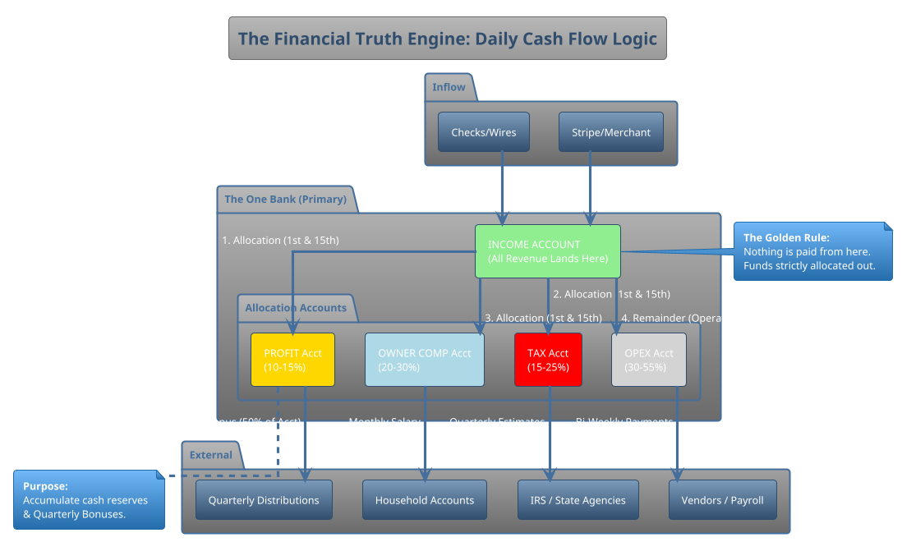

## 14. The Dynasty Education Roadmap (20-Year Gantt)

This visualizes the curriculum from Chapter 32, showing how different educational tracks run in parallel as the heir matures.

```plantuml
@startuml
!theme spacelab
title "Dynasty Heir Development Roadmap (Ages 5-25)"
printscale weekly

projectscale monthly zoom 1.5

' Define phases
[Foundation Phase (5-8)] as [P1] lasts 4 years
[Skill Development (9-12)] as [P2] starts at [P1]'s end and lasts 4 years
[Advanced Training (13-17)] as [P3] starts at [P2]'s end and lasts 5 years
[Professional Mastery (18-25)] as [P4] starts at [P3]'s end and lasts 7 years

' -- Financial Literacy Track --
[The 3-Jar System (Save/Spend/Give)] as [Fin1] starts at [P1]'s start and lasts 4 years
[Budgeting & Savings Goals] as [Fin2] starts at [P2]'s start and lasts 4 years
[Investment Portfolio (Stocks/Bonds)] as [Fin3] starts at [P3]'s start and lasts 5 years
[Wealth Theory & Tax Strategy] as [Fin4] starts at [P4]'s start and lasts 7 years

' -- Entrepreneurship Track --
[Chore "Business" & Lemonade Stand] as [Biz1] starts at [P1]'s start and lasts 4 years
[Micro-Business (Crafts/Service)] as [Biz2] starts at [P2]'s start and lasts 4 years
[Digital Business / Freelancing] as [Biz3] starts at [P3]'s start and lasts 5 years
[Real Venture / OpCo Management] as [Biz4] starts at [P4]'s start and lasts 7 years

' -- Governance & Leadership --
[Family Values & Storytelling] as [Gov1] starts at [P1]'s start and lasts 4 years
[Junior Council Observer] as [Gov2] starts at [P2]'s start and lasts 4 years
[Community Leadership Project] as [Gov3] starts at [P3]'s start and lasts 5 years
[Voting Member / Board Seat] as [Gov4] starts at [P4]'s start and lasts 7 years

' Milestones
[First Bank Account] happens at [P1]'s end
[First LLC Formed] happens at [P2]'s end
[Investment Acct Handover] happens at [P3]'s end
[Council Induction] happens at [P4]'s end

@enduml
```

## 15. The "Boring Business" Acquisition Funnel

This diagram operationalizes the M&A strategy from Volume VIII, visualizing the flow from identifying a target to closing the deal.

```plantuml
@startuml
!theme spacelab
title "Boring Business Acquisition Pipeline"

|#e8f4f8|Sourcing|
start
:Input: BizBuySell / Outreach / Brokers;
:Filter: "The Buy Box" Check;
note right
  - SDE > $100k
  - 10+ Years History
  - Owner Retiring
end note

if (Passes Buy Box?) then (No)
  stop
else (Yes)
  :Initial Call w/ Broker/Owner;
endif

|#d4ebf2|Evaluation|
:Obtain NDAs & CIM (Confidential Memo);
:Analysis: "Napkin Math" Valuation;
if (Valuation < 3x SDE?) then (No)
  stop
else (Yes)
  :Site Visit / Owner Meeting;
endif

|#c0dee6|Offer|
:Draft LOI (Letter of Intent);
:Negotiate Terms (Seller Finance %);
if (LOI Accepted?) then (No)
  stop
else (Yes)
  :Move to Due Diligence (60 Days);
endif

|#acd0db|Due Diligence|
fork
  :Financial Audit (QBO Verification);
fork again
  :Operational Audit (Tech/Process);
fork again
  :Legal Audit (Liens/Contracts);
end fork

if (Red Flags Found?) then (Yes)
  :Renegotiate or Walk;
  if (Deal Saved?) then (No)
    stop
  endif
endif

|#98c2d0|Closing|
:Draft Purchase Agreement (APA);
:Secure Funding (SBA / Cash / Seller Note);
:Wire Funds & Sign;
:Day 1 Takeover;

|#84b4c5|Integration|
:Deploy "North Star" Tech Stack;
:Install ElectroNeek Bots;
:Optimize Pricing;
stop

@enduml
```

## 16. Agency Service Blueprint (Service Delivery)

This swimlane diagram shows the interplay between the **Client**, the **Automation System** (North Star), and the **Delivery Team**.

```plantuml
@startuml
!theme spacelab
title "Agency Service Delivery Blueprint"

|Client|
start
:Submits Order Form (SuiteDash);
:Pays Invoice;

|#Lavender|Automation System|
:Triggers "New Order" Sequence;
:1. Auto-Create Project in SuiteDash;
:2. Auto-Generate Contract;
:3. Create Google Drive Folder;
:4. Send "Welcome" Email + Portal Invite;
:5. Notify Team (Slack);

|Client|
:Receives Welcome Email;
:Logs into Portal;
:Uploads Onboarding Assets;

|#Lavender|Automation System|
:Detects File Upload;
:Moves Files to Correct Folder;
:Updates Project Status to "In Progress";
:Assigns Tasks to Team;

|Delivery Team|
:Receives Task Notification;
:Executes Service (e.g., Builds Funnel);
:Uploads Draft to Portal;
:Marks Task "Ready for Review";

|#Lavender|Automation System|
:Auto-Emails Client "Review Ready";

|Client|
:Reviews Deliverable;
if (Approved?) then (No)
  :Requests Revision;
  |Delivery Team|
  :Executes Revision;
else (Yes)
  |Automation System|
  :Triggers "Project Completion";
  :Sends Final Files;
  :Requests Review/Referral;
  stop
endif
@enduml
```

## 17. Digital Sovereignty & Kill Switch Protocol

This protocol visualizes the emergency access and digital succession workflow to ensure heirs can access critical assets.

```plantuml
@startuml
!theme spacelab
title "Digital Sovereignty & Kill Switch Protocol"

|Trigger Event|
start
:Death or Incapacity;

|Immediate Response (0-24h)|
fork
  :Spouse Accesses Safe;
  :Locates "Red File";
  :Retrieves Master Password Sheet;
fork again
  :Trustee Notified;
  :Initiates Legal Protocol;
end fork

|Digital Access (Day 1-7)|
:Spouse Logs into Password Manager (Vault);
:Accesses Primary Email (2FA Root);
if (Phone Locked?) then (Yes)
  :Use SIM PIN from Red File;
  :Or Use Biometric (Fingerprint);
else (No)
  :Access SMS 2FA Codes;
endif

|Asset Control (Week 2-4)|
fork
  :Crypto Assets;
  :Retrieve Metal Plate (Seed Phrase);
  :Restore Hardware Wallet;
fork again
  :Bank Accounts;
  :Present Trust Certificate;
  :Assume Signer Authority;
fork again
  :Cloud Infrastructure;
  :Login to SuiteDash Admin;
  :Transfer Admin Rights;
end fork

:Full Sovereign Control Established;
stop
@enduml
```
