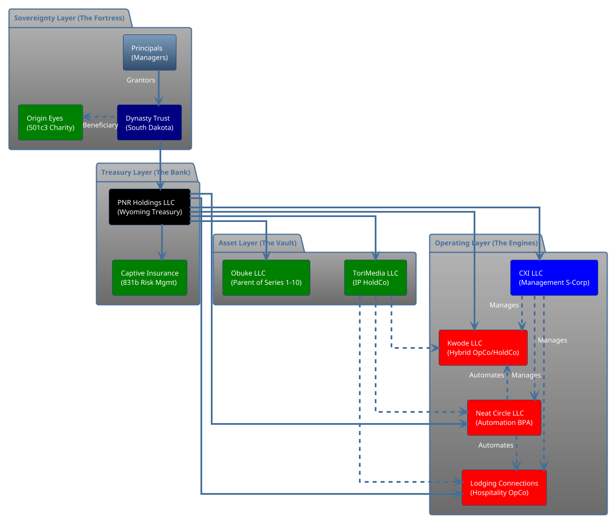
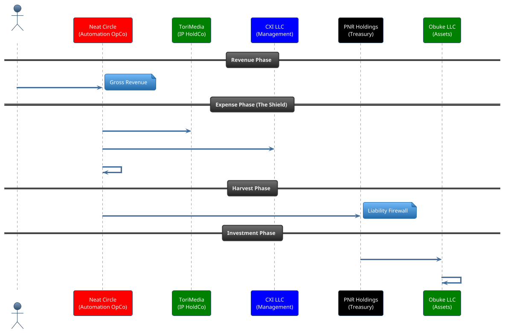
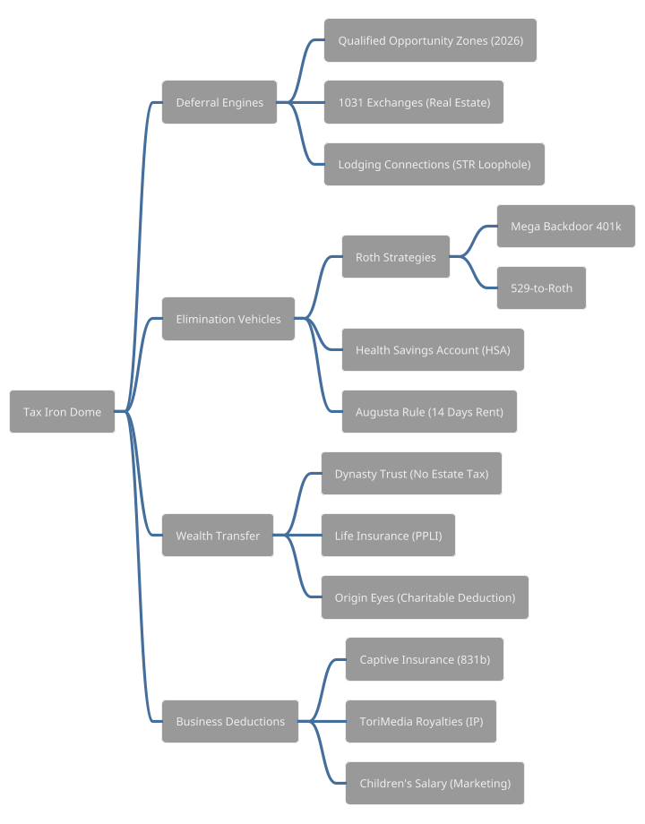

---

## 6. PlantUML Alternatives (Advanced Visualization)

For users preferring Graphviz/PlantUML layout control, here are the source codes for the primary diagrams.

### 6.1 Master Entity Map (Component Diagram)

### 6.2 The Perfect Dollar Sequence

### 6.3 The Tax Iron Dome (Mindmap)

