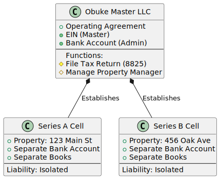
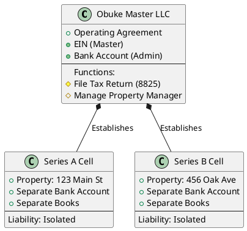
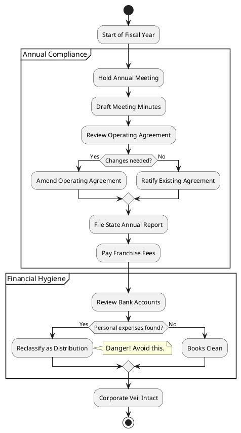
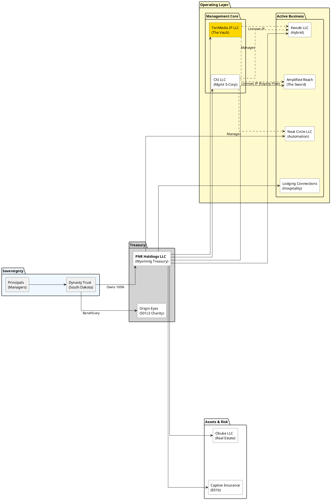

# Book 2: The Engine
## Cash Flow, Revenue Systems, and The Economics of Sovereignty

**By Ikechukwu Ohu**

---

## Introduction to the Series: The 365-Year Vision

Most people build for the weekend. Some build for retirement. We build for 365 years.

This book is not a theory. It is the foundational operating manual of the Ohu Dynasty. It contains the exact legal, philosophical, and strategic frameworks we use to ensure our family's sovereignty survives three centuries of chaos.

**The Higher Purpose:**
We build for 365 years not for the sake of accumulation, but to create a stable platform for Christian charity and influence. Our businesses are the "fishing nets" of the modern era—means of connecting with the world and serving it with integrity.

### The Engine Room: Entity Roles

Before we build the systems, we must define the machines. The Dynasty's revenue is generated by four distinct engines, each with a specific legal and operational mandate:

1.  **Kwode LLC (Hybrid OpCo/HoldCo)**: The "Authority" Engine.
    *   **Brands:** Notroom Services (Notary), TaxEar Advisory (Tax).
    *   **Role:** High-trust professional services requiring human licensure.
    *   **Status:** Active Operations + Digital Asset Holding.

2.  **Neat Circle LLC (Automation OpCo)**: The "Efficiency" Engine.
    *   **Services:** Business Process Automation (BPA), AI Workflow Design, Tech Implementation.
    *   **Role:** High-scale technical services that leverage code over labor.

3.  **Lodging Connections LLC (Hospitality OpCo)**: The "Cash Flow" Engine.
    *   **Services:** Corporate Housing, Short-Term Rentals.
    *   **Role:** Asset monetization and tax shelter (STR Loophole).

4.  **Obuke LLC (Real Estate HoldCo)**: The "Wealth" Engine.
    *   **Assets:** Physical Property, Notes, Deeds.
    *   **Role:** Passive asset accumulation and protection.
    *   **Philanthropic Role:** Leases facilities to Origin Eyes (Nonprofit) at fair market rates (Triple-Net Lease).

5.  **CXI LLC (Management S-Corp)**: The "Brain" Engine.
    *   **Role:** Provides executive management to all entities, including Origin Eyes (Nonprofit), via Management Services Agreements.

6.  **ToriMedia IP LLC (Asset HoldCo)**: The "Soul" Engine (The Vault).
    *   **Role:** Passive holding of the "ToriMedia" brand, the 24-Service Content Library, and all proprietary methodologies.
    *   **Key Assets:**
        *   **The Amplified Reach Operating System (AR-OS)**: The proprietary SuiteDash/AITable process engineering bundle (6 Pipelines, 180+ workflows).
        *   **The 24-Service Content Library**: The "Full Stack" creative catalog.
    *   **Income:** Collects royalties from the Agency and licenses content to Origin Eyes.

7.  **Amplified Reach LLC (Operating OpCo)**: The "Voice" Engine (The Sword).
    *   **Role:** Active execution of the "Full-Stack Growth Partner" services (Content, Traffic, Conversion).
    *   **Function:** Signs client contracts, takes operational risk, and pays licensing fees to ToriMedia IP LLC.

### The Series LLC Structure Visualization

This diagram shows the relationship between the Master LLC and its individual Series Cells, illustrating how liability is isolated for each property.

### The Corporate Veil Maintenance Cycle Visualization

This activity diagram illustrates the annual checklist required to maintain the corporate veil and ensure legal protection.

### The Cash Flow Engine Visualization

This sequence diagram illustrates the **velocity of money** through these engines. It shows how a single dollar travels from a client to a protected asset.

**Source Code:**

### Implementation Guide
1.  **Revenue:** Client pays the OpCo (Neat Circle/Kwode).
2.  **Shielding:** OpCo immediately pays its bills (IP Royalties, Mgmt Fees) to move money into safer entities.
3.  **Sweeping:** Once a month, OpCo sweeps "Excess Profit" to PNR Holdings (Treasury).
4.  **Investing:** PNR Holdings buys Assets (Real Estate) via Obuke LLC.
5.  **Result:** The money ends up in a Green Box (Asset), safe from the Red Box (Liability).

---

---

# Chapter 10: Notary & RON Services Empire

## Introduction

Notary and Remote Online Notarization (RON) services represent the "immediate cash flow" engine of the Legacy Codex. Unlike other business models that require long lead times, notary services can generate revenue within days of launch. This chapter provides a comprehensive blueprint for building a scalable, high-margin notary empire that leverages both traditional mobile services and cutting-edge RON technology.

For Kwode LLC (dba Notroom Services), this is not just about signing documents; it's about building a professional services infrastructure that serves as the foundation for broader real estate and legal services. By mastering this domain, you create a reliable stream of daily cash flow while building a network of high-value contacts in the real estate and legal sectors.

This chapter covers everything from traditional operations and RON scaling to Loan Signing Agent mastery and pricing optimization.

---

## Section 10.1: Traditional Notary Operations

Traditional mobile notary services remain a high-demand service, particularly for high-stakes transactions where in-person verification is preferred or required. This section details the operational framework for a premium mobile notary service.

### State Licensing Requirements

**Pennsylvania Requirements (Primary Market)**:
- **Eligibility**: 18+ years old, US citizen/resident, resident of PA (or employed in PA), read/write English.
- **Education**: Complete 3-hour approved notary education course (within 6 months of application).
- **Application**: Submit application online via Department of State.
- **Fee**: $42 application fee.
- **Bond**: $10,000 surety bond required.
- **Oath**: Take oath of office at Recorder of Deeds within 45 days of appointment.
- **Recording**: Record signature and bond at Recorder of Deeds.

**Wyoming Requirements (Entity Domicile)**:
- While Notroom Services is a Wyoming LLC, notary commissions are individual and state-specific. You must be commissioned in the state where you physically perform the notarization.
- **Strategy**: Maintain PA commission for operations; consider Wyoming commission if physical presence is established.

**Maintenance**:
- **Term**: 4 years in PA.
- **Renewal**: Requires education and reappointment.
- **Changes**: Report address/name changes within 30 days.

### Equipment and Supplies

**Essential Kit**:
1.  **Official Stamp/Seal**: Compliant with PA state regulations (rubber stamp preferred for copying).
2.  **Notary Journal**: Bound, numbered pages (required by PA law).
3.  **Biometric Security**: Fingerprint pad for journal (best practice for fraud prevention).
4.  **Mobile Office**:
    -   **Laptop**: High-performance, secure.
    -   **Portable Scanner**: Fujitsu ScanSnap or similar for immediate scan-backs.
    -   **Portable Printer**: HP OfficeJet 200 or similar (optional but recommended for last-minute changes).
    -   **Hotspot**: Reliable 5G connection.
5.  **Professional Attire**: Business casual or formal depending on client.

**Supply Chain**:
- Establish accounts with NNA (National Notary Association) or local suppliers for quick replenishment.

### Marketing to Attorneys & Title Companies

**Target Audience**:
- **Title Companies**: High volume, recurring loan signings.
- **Estate Planning Attorneys**: Wills, trusts, powers of attorney.
- **Family Law Attorneys**: Divorce decrees, custody agreements.
- **Real Estate Agents**: Closing documents.

**Value Proposition**:
- "We don't just stamp; we ensure the transaction closes."
- 24/7 availability (premium pricing).
- Error-free guarantee (or we fix it free immediately).
- Professional presentation representing their brand.

**Outreach Strategy**:
1.  **The "Snack & Sign"**: Drop off branded snacks with rate cards to local title offices.
2.  **LinkedIn Networking**: Connect with Escrow Officers and Paralegals (the real decision-makers).
3.  **Reliability Campaign**: "When your regular notary cancels, call us. We are the backup plan that becomes the primary plan."

### Mobile Notary Premium Pricing

**Standard vs. Premium**:
- **Standard**: State-regulated fees (e.g., $5 per stamp in PA). *Do not build a business on this.*
- **Premium (Mobile Service)**: Charge for *convenience* and *travel*.
    -   **Travel Fee**: $50 - $100 depending on distance/time.
    -   **After-Hours Fee**: +$50 surcharge.
    -   **Holiday/Weekend Fee**: +$75 surcharge.
    -   **Hospital/Jail Fee**: +$100 surcharge (high complexity/wait times).

**Pricing Psychology**:
- Quote a flat "Appointment Fee" that includes travel and the first stamp.
- Example: "Our mobile appointment fee is $85, which includes travel to your location and the first notarization. Additional stamps are $5 each."

### Error Prevention Protocols

**The "Perfect Signing" Checklist**:
1.  **Pre-Appointment**: Verify document type, number of signers, and ID requirements.
2.  **At Arrival**: Verify IDs immediately. Record in journal *before* signing.
3.  **During Signing**:
    -   Guide, don't advise (UPL - Unauthorized Practice of Law).
    -   Check for blanks in documents.
    -   Ensure signer awareness and willingness.
4.  **Post-Signing Review**:
    -   **The "Thumb-Through"**: Review every page before leaving the table.
    -   **Stamp Check**: Ensure seal is clear and legible.
    -   **Scan-Back**: Scan documents immediately to cloud for backup (if permitted).

---

## Section 10.2: Remote Online Notary (RON) Scaling

RON is the scalability engine. It removes geographic travel constraints, allowing you to serve clients statewide (and potentially nationwide depending on laws) from your home office.

### Platform Selection and Setup

**Top Platforms**:
1.  **BlueNotary**: User-friendly, good for general notary work.
2.  **Notarize (Proof)**: High volume, enterprise focus, "On-Demand" queue.
3.  **PandaDoc Notary**: Integrated with document workflow.
4.  **Secured Signing**: Robust features.

**Selection Criteria for Notroom Services**:
- **BlueNotary** is recommended for independent scaling due to its "General Notary Work" focus and ability to bring your own clients.
- **Proof (Notarize)** is recommended for filling downtime with on-demand calls (lower fee, higher volume).

**Setup Process**:
1.  **State Approval**: Apply for RON authorization with PA Department of State.
2.  **Technology Provider**: Select platform and notify state.
3.  **Digital Certificate**: Purchase digital certificate (Identrust or IdenTrust).
4.  **eSeal**: Create compliant electronic seal.

### Technology Requirements

**Hardware**:
- **Computer**: Windows or Mac with strong processing power.
- **Webcam**: 1080p or 4K external webcam (clarity is a legal requirement).
- **Microphone**: High-quality USB microphone (Blue Yeti or similar).
- **Internet**: Hardwired Ethernet connection (Wi-Fi is risky for video streams). Minimum 25 Mbps up/down.
- **Dual Monitors**: Essential for viewing the document on one screen and the signer on the other.

**Environment**:
- **Private Room**: Door must close. No other people visible or audible.
- **Lighting**: Ring light or professional key light.
- **Background**: Professional, clean, or branded virtual background.

### Interstate Commerce Opportunities

**The "PA Authority"**:
- As a PA RON, you can notarize for signers *located anywhere in the world*, provided the transaction has a nexus to the US or involves US law, and you are physically located in PA.
- **Target Market**:
    -   US Expats abroad.
    -   Military personnel overseas.
    -   Business travelers.
    -   Out-of-state real estate investors buying PA property.

### Marketing Nationwide

**SEO Strategy**:
- Keywords: "Online Notary PA," "Remote Notary for Expats," "Emergency Online Notary."
- **Directory Listings**: List on 123Notary, NotaryRotary, and Google My Business (optimized for "Online").

**Partnership Strategy**:
- Partner with *other* notaries in non-RON states. "Send me your clients who need online notarization, I'll pay a referral fee."

### Compliance by State

**PA RON Laws (RULONA)**:
- **KBA (Knowledge Based Authentication)**: Signer must pass identity quiz.
- **Credential Analysis**: ID must be validated by software.
- **AV Recording**: Session must be recorded and retained for 10 years.
- **Journal**: Electronic journal required.

**Risk Management**:
- Never bypass KBA/ID analysis.
- Ensure recording is active.
- If video fails, stop the notarization.

---

## Section 10.3: Loan Signing Agent Mastery

Loan Signing Agents (LSAs) facilitate real estate closings. This is the highest-paid tier of general notary work, often commanding $150-$250 per appointment.

### NSA Certification Process

**Certification**:
- **NNA (National Notary Association)**: The industry standard. Most title companies require NNA certification and background check.
- **Loan Signing System (LSS)**: Mark Wills' course. Highly recommended for *practical* training on how to walk a borrower through documents without UPL.

**Steps**:
1.  Complete NNA NSA training.
2.  Pass NNA exam.
3.  Pass NNA background check.
4.  (Optional but Recommended) Complete LSS training for speed and expertise.

### Title Company Partnerships

**Direct Business (The Holy Grail)**:
- **Goal**: Bypass signing services (middlemen) to work directly with Title/Escrow.
- **Strategy**:
    -   Identify top 20 local title offices.
    -   Visit in person (professional dress).
    -   Pitch: "I know you have a preferred notary list. I'd like to be your *emergency* backup for weekends, holidays, and 7 AM/8 PM signings."
    -   Deliver flawless execution on the first chance.

### Signing Service Registration

**The "Fillers"**:
- Signing services take a cut (pay $75-$100 vs $150 direct) but provide volume.
- **Top Platforms**:
    -   SigningOrder.com
    -   Snapdocs
    -   NotaryDash
- **Profile Optimization**:
    -   Upload professional headshot.
    -   Upload all certifications/insurance immediately.
    -   Mark "24/7" availability initially to build rating.

### Document Expertise Development

**Critical Documents**:
- **Closing Disclosure (CD)**: The money page. Know how to explain cash to close.
- **Note**: The debt. Know interest rate, payment, first payment date.
- **Deed of Trust / Mortgage**: The security instrument.
- **Right to Cancel**: The 3-day rescission period (critical dates).
- **1003 (Loan Application)**: Verify accuracy.

**The "Script"**:
- Develop a 1-sentence explanation for every document.
- Example (Deed of Trust): "This document puts your house up as collateral for the loan."

### Quality Control Systems

**The "Triple Check"**:
1.  **Table Check**: Review while signer is present.
2.  **Car Check**: Review immediately after leaving.
3.  **Scan Check**: Review digital scans before shipping.

**Common Errors to Avoid**:
- Missed initials on legal description pages.
- Missed dates.
- Illegible stamps.
- Wrong color ink (stick to blue/black as instructed).

---

## Section 10.4: Pricing & Package Optimization

Maximizing revenue requires moving beyond "per stamp" pricing to value-based packaging.

### Service Bundles Design

**1. The "Closing Concierge" ($200 - $300)**
- Includes: Printing docs (2 sets), travel, signing, scan-backs, FedEx drop-off.
- Value: "Hands-off" service for the Title Officer.

**2. The "Estate Plan Special" ($150 - $250)**
- Includes: Travel to client home, witnessing (bring a witness if needed for extra fee), notarizing Trust, Will, POA, Healthcare Directive.
- Value: Comfort and privacy for seniors.

**3. The "I-9 Verification" ($50 - $75)**
- Includes: Acting as authorized representative for remote hires.
- Value: HR compliance.

### Geographic Pricing Strategies

**Zone-Based Pricing**:
- **Zone 1 (0-10 miles)**: Base Fee.
- **Zone 2 (10-20 miles)**: Base + $25.
- **Zone 3 (20-30 miles)**: Base + $50.
- **Zone 4 (30+ miles)**: Custom Quote.

**Traffic Surcharges**:
- Apply during peak rush hour (7-9 AM, 4-6 PM).

### Rush Service Premiums

**Urgency Matrix**:
- **Standard**: Scheduled 24+ hours in advance.
- **Rush**: Same-day service (+ $35).
- **Emergency**: Within 2 hours (+ $75).
- **Red Eye/Early Bird**: 9 PM - 7 AM (+ $100).

### Volume Discounts

**For Attorneys/Title Companies**:
- "Lock in a flat rate of $125 per closing (normally $150) in exchange for exclusivity or 10+ orders/month."
- **Billing**: Monthly invoicing (Net 15 or Net 30) reduces administrative friction for them.

### Retainer Agreements

**Corporate Retainer**:
- **Target**: Construction companies, auto dealerships, hospitals.
- **Offer**: $500/month for up to 10 notarizations + priority scheduling.
- **Benefit**: Guaranteed recurring revenue (MRR).

---

## Chapter 10 Summary

Notroom Services is the cash flow ignition switch. By combining the high-touch service of mobile notary work with the high-tech scalability of RON, you create a resilient revenue stream.

**Key Takeaways**:
1.  **Get Legal**: Secure PA commission and RON authorization immediately.
2.  **Get Equipped**: Invest in the right scanner and mobile office setup.
3.  **Get Certified**: NNA NSA certification is the ticket to loan signings.
4.  **Get Clients**: Market directly to Title and Attorneys for high-margin work; use platforms for volume.
5.  **Get Paid**: Structure pricing around convenience and value, not just ink.

**Action Items**:
- [ ] Submit PA Notary Application.
- [ ] Complete NNA NSA Training.
- [ ] Purchase BlueNotary or Proof subscription.
- [ ] Order supplies (Stamp, Journal, Scanner).
- [ ] Set up Google My Business profile.

### Cross-References

- [See Chapter 11] Transaction Coordination Domination
- [See Chapter 12] Tax & Enrolled Agent Services
- [See Volume II, Chapter 9] Operating Company Playbooks (Notroom Services)
- [See Volume IV, Chapter 19] SuiteDash Command Center
- [See Chapter 12.5] The Polymath Service Catalog (Detailed Pricing & Packaging)

---

**END OF CHAPTER 10**

---

# Chapter 11: Transaction Coordination Domination

## Introduction

Transaction Coordination (TC) is the operational backbone of the real estate industry. While agents focus on sales and relationships, TCs ensure the deal actually closes. For Kwode LLC (dba Notroom Services), this is a natural evolution from notary work. You are already handling the final documents; moving upstream to manage the entire process captures more value and deepens your integration with real estate investors and agents.

This chapter focuses specifically on "SubTo" (Subject-To) and creative finance coordination, a high-value niche where standard TCs fear to tread. By mastering the complexities of creative finance paperwork, you position Notroom Services as an indispensable partner to the most active investors in the market.

---

## Section 11.1: SubTo Certification & Implementation

"SubTo" refers to acquiring property "subject to" the existing mortgage. It requires specialized knowledge to avoid "due-on-sale" triggers and ensure proper insurance and servicing transfer.

### Course Completion Strategy

**The Pace Morby SubTo Community**:
- **Objective**: You must speak the language of the investor.
- **Action**: If not already enrolled, prioritize the "Transaction Coordinator" module within the SubTo mentorship (or equivalent creative finance training).
- **Key Concepts to Master**:
    -   **Deed of Trust vs. Warranty Deed**: Understanding the transfer of title vs. debt.
    -   **Power of Attorney (Limited)**: Essential for communicating with the seller's lender.
    -   **Authorization to Release Information**: The first document you need signed.
    -   **Due-on-Sale Clause**: How to explain it and how to mitigate it (land trusts, insurance structuring).

### Practical Application

**The "Shadow" Phase**:
- Before taking a paid client, shadow an experienced SubTo TC on 2-3 deals.
- **Offer**: "I will handle all the file organization and communication for free on your next deal if you let me watch your process."

**The "First Deal" Checklist**:
1.  **Purchase and Sale Agreement (PSA)**: Verify it includes "Subject-To" addendums.
2.  **Title Search**: Order immediately to check for liens/judgments.
3.  **Mortgage Statement**: Verify the exact payoff, reinstatement amount (if in foreclosure), and monthly payment.
4.  **Insurance**: The trickiest part. You need a new policy listing the Trust as the insured and the Lender as the mortgagee.

### Network Building

**Where the Investors Are**:
- **Facebook Groups**: "SubTo Official," "Creative Finance with Pace Morby," "Real Estate Investors of [Your City]."
- **Local REIA Meetings**: Go to the meetings. Don't pitch "TC services." Pitch "Creative Finance Transaction Management."
- **Value Add**: "I know how to handle the insurance so the loan doesn't get called." (This is the #1 fear of SubTo investors).

### First Client Acquisition

**The "Beta" Offer**:
- "I am a certified SubTo student launching my TC division. I'm looking for 3 investors to work with at a 50% discount ($250 instead of $500) in exchange for a video testimonial."
- **Deliverable**: A flawlessly organized Dropbox/Google Drive folder with every document named correctly.

### Success Stories Development

**The Case Study**:
- Document the "Save": "How we cleared a $5,000 surprise lien 2 days before closing."
- **Format**: 1-page PDF or a 60-second video for social media.
- **Distribution**: Post in the investor groups (with permission).

---

## Section 11.2: Service Delivery Systems

Scalability requires that you do not reinvent the wheel for every deal.

### Intake Procedures

**The Intake Form (SuiteDash)**:
- **Trigger**: Investor clicks "Start New Transaction" in their portal.
- **Required Fields**:
    -   Property Address.
    -   Seller Contact Info.
    -   Buyer Entity Name.
    -   Closing Date.
    -   Title Company Contact.
    -   Upload PSA.
- **Automation**:
    -   Creates Project in SuiteDash.
    -   Sends "Intro Email" to Seller, Buyer, and Title.
    -   Creates "Task List" from template.

### Timeline Management

**Critical Dates Tracking**:
- **Inspection Period Ends**: Remind buyer 48 hours prior.
- **Earnest Money Deposit (EMD) Due**: Verify receipt by Title.
- **Loan Objection Deadline**: (If applicable).
- **Closing Date**: Confirm with all parties.

**The "Friday Update"**:
- Every Friday, send a status email to all parties. "Here is what happened this week, here is what is pending, here is what to expect next week."
- **Why**: This prevents the "What's going on?" texts on Saturday night.

### Communication Protocols

**The "Hub" Model**:
- You are the hub. All info flows through you.
- **Rule**: Never forward an email without reading it and adding context.
- **Templates**:
    -   "Intro to Seller" (Reassuring, professional).
    -   "Intro to Title" (Directive, specific instructions on SubTo).
    -   "Clear to Close" (Celebratory, logistics).

### Document Management

**Folder Structure (Standardized)**:
1.  **01_Contracts**: PSA, Addendums.
2.  **02_Disclosures**: Seller's Disclosure, Lead Paint.
3.  **03_Title**: Commitment, Tax Cert, Wire Instructions.
4.  **04_Lender**: Payoff Statement, Reinstatement Quote.
5.  **05_HOA**: Resale Cert, Bylaws.
6.  **06_Closing**: HUD-1/ALTA, Signed Docs.

### Closing Coordination

**The Final Mile**:
- **HUD Review**: Check the numbers. Is the assignment fee correct? Is the TC fee on there?
- **Scheduling**: Coordinate the notary (Self-referral opportunity!).
- **Utility Transfer**: Remind seller to cancel, buyer to start.
- **Key Exchange**: Coordinate lockbox or physical handoff.

---

## Section 11.3: Real Estate Network Building

Your net worth is your network. TCs are in a unique position to know *everyone*.

### Agent Partnership Strategies

**The "Leverage" Pitch**:
- "Agent, you hate paperwork. You hate chasing signatures. I love it. Let me handle your contract-to-close for $350, and you can spend that 10 hours finding your next client."
- **Benefit**: You become an expense line item that *makes* them money by freeing up their time.

### Broker Relationships

**The "Compliance" Pitch**:
- "Broker, my files are audit-proof. I ensure every required disclosure is signed and filed before the check is cut. Hiring me reduces your liability."

### Investor Connections

**The "Deal Flow" Pitch**:
- "I see a lot of deals. Sometimes I see deals that don't fit one investor but fit another. If I'm your TC, you're on my short list for off-market opportunities."

### Wholesale Partnerships

**The "Dispo" Pitch**:
- Wholesalers are great at finding deals but terrible at paperwork.
- "I will manage the transaction between you, the seller, and the end buyer. I'll keep the assignment fee confidential (blind HUD) so the seller doesn't freak out."

### Attorney Alliances

**The "Drafting" Pitch**:
- "I handle the coordination; you handle the legal review. I'll bring you the clean files that just need your stamp of approval."

---

## Section 11.4: Scaling Through VAs

You cannot scale if you are chasing every signature yourself.

### Task Delegation Framework

**What YOU Do (High Value)**:
- Client relationship management.
- Solving complex problems (title issues).
- Final file review.

**What VA Does (Low Value/Repetitive)**:
- Data entry into SuiteDash.
- Sending template emails.
- Chasing signatures (Docusign reminders).
- Ordering HOA docs.
- Utility transfer coordination.

### VA Training Programs

**The "SOP Library"**:
- Record a Loom video for *every* task.
- "How to open a file."
- "How to order a payoff."
- "How to audit a HUD."
- **Platform**: Host these in your SuiteDash "Company Wiki."

### Quality Control Systems

**The "Daily Huddle"**:
- 15-minute Zoom call every morning.
- "What are the 3 priorities today? What is stuck?"

**The "Audit Checklist"**:
- VA must complete a checklist before marking a file "Ready for Review."

### Performance Management

**KPIs for VAs**:
- **Response Time**: Email response within 2 hours during business hours.
- **Accuracy**: Zero errors on data entry.
- **File Velocity**: Average days from contract to close.

### Compensation Structures

**Model**:
- **Base Pay**: Hourly rate ($5-$10/hr for offshore).
- **Bonus**: Per-file bonus ($25-$50) for 5-star reviews or error-free closings.
- **Why**: Incentivizes quality and volume.

---

## Chapter 11 Summary

Transaction Coordination is the glue that holds the real estate empire together. By specializing in creative finance (SubTo), you differentiate yourself from the commodity TCs and command higher fees ($500-$750 per file vs. $350).

**Key Takeaways**:
1.  **Niche Down**: Own the "Creative Finance" TC space.
2.  **Systematize**: Use SuiteDash to automate the mundane.
3.  **Network Up**: Partner with the wholesalers and agents who control the deal flow.
4.  **Delegate**: Hire a VA as soon as you hit 10 files a month.

**Action Items**:
- [ ] Create "Transaction Coordination" pipeline in SuiteDash.
- [ ] Draft "Intro" and "Update" email templates.
- [ ] Join 3 Creative Finance Facebook groups.
- [ ] Create a "TC Services" one-pager PDF.

### Cross-References

- [See Chapter 10] Notary & RON Services Empire
- [See Chapter 16] Creative Financing Mastery (SubTo deals)
- [See Volume II, Chapter 9] Operating Company Playbooks (Transaction Coordination)
- [See Volume IV, Chapter 19] SuiteDash Command Center
- [See Chapter 12.5] The Polymath Service Catalog (Detailed Pricing & Packaging)

---

**END OF CHAPTER 11**

---

# Chapter 12: Tax & Enrolled Agent Services

## Introduction

Kwode LLC (dba TaxEar Advisory) represents the "high authority" pillar of the Legacy Codex. While notary work provides cash flow and transaction coordination provides operational glue, tax services provide *authority*. As an Enrolled Agent (EA), you are not just a service provider; you are a federally licensed tax practitioner with unlimited rights to represent taxpayers before the IRS.

This status elevates the entire brand ecosystem. It allows you to offer high-margin advisory services, defend your own real estate strategies (like REPS and Cost Segregation), and capture the recurring revenue of tax preparation and bookkeeping. This chapter outlines the path from exam preparation to building a scalable tax practice.

---

## Section 12.1: EA Exam Conquest Strategy

The Special Enrollment Examination (SEE) is a three-part exam. Passing it is the barrier to entry that protects your margins.

### Study Plan (Part 1, 2, 3, SEE)

**The "Sprint" Strategy**:
- Do not drag this out. Aim to pass all three parts within 3-6 months.
- **Part 1: Individuals**: Focus on income, deductions, and credits. (Study time: 4-6 weeks).
- **Part 2: Businesses**: Focus on partnerships, corporations, and specialized returns. (Study time: 6-8 weeks). *This is the hardest part.*
- **Part 3: Representation, Practices and Procedures**: Focus on ethics, appeals, and collections. (Study time: 3-4 weeks).

**Daily Routine**:
- **Morning (1 hour)**: Fresh concepts. Read new material.
- **Evening (1 hour)**: Review and practice questions.
- **Weekend (4 hours)**: Full mock exams.

### Resource Optimization

**Recommended Providers**:
- **Gleim**: The gold standard. Their test bank is harder than the actual exam. If you pass Gleim, you pass the SEE.
- **PassKey**: Good alternative, slightly more concise.
- **Fast Forward Academy**: Budget-friendly, good for quick review.

**Strategy**:
- Buy the "Premium" package with the adaptive learning technology. It focuses you on your weak areas.
- **Don't read the whole book.** Focus on the practice questions. Read the explanations for every wrong answer.

### Testing Strategies

**The "Flag and Move" Method**:
- You have 3.5 hours for 100 questions.
- If you don't know the answer in 30 seconds, **flag it and move on**.
- Answer the easy ones first to build momentum and bank points.
- Return to the flagged questions with remaining time.
- **Never leave a blank**. There is no penalty for guessing.

### Continuing Education

**Maintenance**:
- **Requirement**: 72 hours every 3 years (minimum 16 hours per year, including 2 hours of ethics).
- **Strategy**: Use CE to deepen your niche expertise (e.g., "Real Estate Taxation," "Crypto Taxation").
- **Provider**: Sequoia CPE or similar online bundles.

### Ethics Requirements

**Circular 230**:
- This is your bible. Read it. Know it.
- **Key Rule**: Do not be "willfully blind." If a client's numbers look fake, you have a duty to ask questions.

---

## Section 12.2: Tax Practice Development

Once licensed, you need clients. But not just any clients—you want high-value clients.

### Niche Selection

**The "Generalist" Trap**:
- Do not be "a tax guy for everyone." You will compete with H&R Block on price.
- **The TaxEar Niche**: **"Real Estate Investors & Small Business Owners."**
    -   Why? They have complex returns, they value planning, and they are willing to pay for it.
    -   Synergy: This feeds your Real Estate and TC businesses.

### Service Offerings

**1. Tax Preparation (Compliance)**
- 1040 (Individual): $500+
- 1065/1120S (Business): $1,200+
- **Value Add**: "We don't just file; we review for missed opportunities."

**2. Tax Planning (Advisory)**
- **The "Tax Blueprint"**: A comprehensive plan delivered in Q4.
- **Price**: $1,500 - $5,000.
- **Content**: Entity selection, retirement planning, vehicle deductions, hiring children, Augusta rule.

**3. Bookkeeping (Recurring)**
- **Price**: $300 - $1,000/month.
- **Why**: You can't do good tax returns with bad books. Control the data input.

### Pricing Strategies

**Value Pricing**:
- Never bill by the hour. Bill by the *form* or by the *value*.
- **The "Minimum"**: "Our minimum engagement fee is $500. If your return is simpler than that, you are better served by TurboTax."
- **The "Bundle"**: "Tax Prep + Quarterly Planning + Annual Bookkeeping review = $250/month." (Smooths cash flow).

### Client Acquisition

**The "Review" Offer**:
- "I will review your last 3 years of tax returns for free. If I find missed savings, I'll amend them for a fee. If not, you have peace of mind."
- **Conversion**: If you find savings, they become a client for life.

**Referral Partners**:
- **Financial Advisors**: They need a CPA/EA to refer to.
- **Real Estate Agents**: "I can help your investors calculate their after-tax ROI."

### Retention Programs

**The "Client Portal" Experience**:
- Use SuiteDash.
- Secure document upload (no email attachments).
- E-signatures.
- "We make it easy."

---

## Section 12.3: IRS Representation Services

This is the "SWAT Team" service. High stress, high stakes, high fees.

### Audit Representation

**The Service**:
- Standing between the taxpayer and the IRS.
- **Fee**: $2,500 retainer + $250/hour.
- **Strategy**: Control the flow of information. Never let the client talk to the auditor.

### Offer in Compromise (OIC)

**The "Pennies on the Dollar"**:
- Settling tax debt for less than the full amount.
- **Fee**: $3,000 - $5,000 flat fee.
- **Warning**: Pre-qualify strictly. Most people do not qualify. Do not take the fee if they have assets.

### Payment Plans (Installment Agreements)

**The "Setup"**:
- Setting up a monthly payment plan for clients who owe.
- **Fee**: $250 - $500.
- **Value**: Stopping the levies and liens.

### Penalty Abatement

**The "First Time"**:
- Requesting First Time Abatement (FTA) for clean compliance history.
- **Fee**: $500.
- **Effort**: Often just a phone call or a letter. High ROI.

### Appeals Process

**The "Escalation"**:
- Taking a case to the IRS Office of Appeals if the auditor is unreasonable.
- **Fee**: Hourly or project-based.

---

## Section 12.4: Year-Round Revenue Model

Tax season is Jan-April. You need revenue May-Dec.

### Tax Planning Services

**The "Q4 Sprint"**:
- Market heavily in October/November.
- "Don't wait until April 15th. It's too late then. Let's plan now."
- **Focus**: Spending, deferrals, harvesting losses.

### Bookkeeping Integration

**Monthly Recurring Revenue (MRR)**:
- Use QuickBooks Online or Xero.
- Automate bank feeds.
- Reconcile monthly.
- **Benefit**: Tax season becomes a non-event because the books are already done.

### Business Consulting

**The "CFO Lite"**:
- Quarterly meetings to review P&L.
- "Your labor costs are up. Your margins are down. Let's fix it."
- **Fee**: $500/quarter.

### Financial Planning

**The "Holistic" View**:
- While you may not sell stocks (unless licensed), you advise on the *tax impact* of investments.
- "Selling that rental property will trigger $50k in tax. Let's look at a 1031 exchange."

### Referral Partnerships

**The "Ecosystem"**:
- Refer clients to Notroom Services for notarizations.
- Refer clients to your Directory sites.
- Refer clients to your Real Estate arm for investing.

---

## Section 12.5: The Wealth Management Expansion (CFP + RIA)

**The "Super Professional" Empire**:

You are not just a Tax Professional. You are a **Polymath Authority**. Your stack of credentials creates a "moat" that no competitor can cross. You are:

1.  **Enrolled Agent (EA)**: Federally licensed tax expert.
2.  **Certified Financial Planner (CFP)**: (In progress) The gold standard for wealth planning.
3.  **Real Estate Agent**: Licensed to buy/sell property.
4.  **Mortgage Loan Originator (MLO)**: Licensed to structure debt.
5.  **NNA Certified Signing Agent (RON)**: Licensed to execute documents.
6.  **Transaction Coordinator**: Master of real estate logistics.
7.  **Engineering Professor**: PhD in Engineering Science & MSIE (Industrial Engineering).
8.  **Nielsen Norman Certified UX Researcher & Manager**: Master of user experience and system design.

This combination is unique. 99% of advisors are salespeople. You are an **Engineer of Wealth**.

This section outlines how to layer the **Certified Financial Planner (CFP)** and **Registered Investment Advisor (RIA)** credentials on top of your tax practice to build the ultimate "One-Stop Shop" for wealth.

### The "Triple Threat" Strategy

**Why Add Wealth Management?**
1.  **Retention**: Tax clients leave for price. Wealth clients stay for relationship.
2.  **Recurring Revenue (AUM)**: 1% of Assets Under Management (AUM) is the "Holy Grail" of passive-ish income.
3.  **Holistic Advice**: You cannot truly advise on tax strategy without knowing the investment strategy.

**The Hierarchy**:
-   **EA (Tax)**: The "Hook." Everyone has to file taxes. It gets you the data.
-   **CFP (Planning)**: The "Roadmap." You sell the plan (fee-for-service).
-   **RIA (Investing)**: The "Engine." You manage the assets (recurring fee).

### CFP vs. CFA vs. RIA: The Right Path

**The Question**: "CFP or CFA? Do I need the certification?"

**The Answer**: **CFP is the correct path for you.**
-   **CFA (Chartered Financial Analyst)**: Focused on *investment analysis* (picking stocks, hedge funds). It is for institutional analysts. It is "Back Office."
-   **CFP (Certified Financial Planner)**: Focused on *holistic planning* (retirement, tax, estate, insurance). It is for client-facing advisors. It is "Front Office."
-   **RIA (Registered Investment Advisor)**: This is a *legal structure*, not a designation. You *start* an RIA firm. You *become* an Investment Advisor Representative (IAR).

**Do you really need the CFP?**
-   **Legally?** No. You only need the Series 65 exam to give advice.
-   **Practically?** Yes. The CFP is the "Gold Standard" for trust. It justifies higher fees ($250-$500/hr vs $150/hr) and attracts HNW clients.
-   **Your PhD Advantage**: Your Engineering PhD demonstrates the *cognitive capacity* to crush the exams, but the CFP curriculum provides the specific *domain knowledge* (Trusts, Insurance, Investments) you need.

### The Licensing Roadmap (90-Day Launch)

You can launch your Wealth Management arm in 90 days.

#### Phase 1: The Legal Key (Days 1-30)
**Goal**: Pass the Series 65 Exam.
-   **What is it?**: The Uniform Investment Adviser Law Examination. It allows you to act as an Investment Advisor Representative (IAR) without a broker-dealer sponsor.
-   **No Degree Required**: Your PhD helps, but isn't required.
-   **Study Plan**:
    -   **Provider**: Kaplan or PassPerfect.
    -   **Time**: 2-4 weeks (given your academic background).
    -   **Content**: Economic factors, investment vehicles, client strategies, ethics.
    -   **Result**: Once passed, you can legally charge fees for investment advice.

#### Phase 2: The CFP Conquest (Days 31-180)
**Goal**: Complete Education & Pass Exam.
-   **Education Requirement**:
    -   **PhD Impact**: Does your Industrial Engineering MSIE and Engineering Science PhD count towards education credits? **Generally, no.** The CFP Board typically only waives the education requirement for a PhD in Business, Economics, or Finance, or for a licensed CPA/Attorney.
    -   **Action**: Submit your transcripts for review just in case, but **assume you must complete the coursework**.
    -   **Strategy**: Use a "Self-Paced" provider like **Dalton Education** or **Danko**.
    -   **Accelerated Plan**: You are a Professor. You know how to study. Blast through the 7 required modules (Fundamentals, Insurance, Investment, Tax, Retirement, Estate, Capstone) in 3-4 months instead of the usual 12.
-   **Experience**: Your real estate and business experience may count toward the 6,000-hour requirement.

#### Phase 3: Launching the RIA (Days 60-90)
**Goal**: Open for Business.
-   **State Registration**: Since you have <$100M AUM, you register with your *State*, not the SEC.
-   **Compliance**: Use a service like **XY Planning Network** or **Ria in a Box** to handle the filings (Form ADV).
-   **Custodian**: Choose a custodian to hold client money (e.g., **Altruist**, **Charles Schwab**, or **Betterment for Advisors**).
    -   *Recommendation*: **Altruist** is tech-forward, no minimums, and integrates beautifully with modern tech stacks.

### Branding Your Future CFP Firm

You are building a "Family Office for the Middle Class."

-   **Brand Name**: **Legacy Engineering Wealth Partners** (or similar).
-   **Tagline**: "Wealth Architecture for the Modern Sovereign."
-   **Value Proposition**: "We don't just manage money. We engineer your entire financial ecosystem using tax, real estate, and investment strategies tailored for multi-generational wealth."
-   **Visual Identity**: Clean, precise, engineering-focused. Use your UX skills to create a brand that feels "smart" and "efficient," not "stuffy" like a bank.

### The "Holistic Offer Ladder"

Combine your superpowers into a unique pricing model.

1.  **The "Financial Physical" ($500 - $1,000)**
    -   Review of Tax Returns (3 years).
    -   Review of Investment Portfolio.
    -   Review of Insurance Gaps.
    -   Deliverable: One-page "Gap Analysis."

2.  **The "Engineering Wealth Plan" ($2,500 - $5,000 One-Time)**
    -   Deep dive comprehensive financial plan.
    -   Retirement projections (Monte Carlo analysis).
    -   Tax optimization strategy.
    -   Estate planning coordination.
    -   *Why You Win*: As a **Nielsen Norman Certified UX Researcher**, you will design a plan that is **usable**. No 100-page PDF blocks. You deliver an interactive, clear, and actionable dashboard that clients actually understand.

3.  **The "Private Client" Retainer (AUM + Fee)**
    -   **Asset Management**: 1% of AUM (managed by you/custodian).
    -   **Tax Prep & Planning**: Included or discounted.
    -   **Concierge Service**: Quarterly meetings.
    -   **Target**: Clients with $500k+ investable assets.

### SuiteDash Integration for Wealth Management

Use your **Nielsen Norman Certified UX** skills to design a frictionless onboarding experience that sets you apart from clunky traditional firms.

**The Wealth Onboarding Funnel (SuiteDash)**:
1.  **Trigger**: Client accepts "Financial Physical" proposal.
2.  **Data Collection (GoZen/SuiteDash Form)**:
    -   "Upload your Statements" (Encrypted upload portal).
    -   "Risk Tolerance Questionnaire" (Embed riskalyze/Totum or build custom logic).
    -   "Goal Setting" (Retirement, College, Travel).
3.  **Automation**:
    -   Auto-create "Financial Plan" project in SuiteDash.
    -   Assign tasks to you: "Analyze Portfolio," "Run Tax Projection."
    -   Auto-send "Welcome to Wealth Management" email sequence.
4.  **Client Portal**:
    -   Create a "Wealth Dashboard" circle.
    -   Embed performance reporting (from Altruist/Blueleaf).
    -   Show "Net Worth" tracking.

### Profitability Outlook

**Year 1 Potential**:
-   **Tax/EA**: $100k (Tax Prep + Consulting).
-   **Planning Fees**: $50k (10 plans @ $5k).
-   **AUM Fees**: $10k (Start slow, takes time to build assets).
-   **Total**: **$160k+**

**Year 3 Potential**:
-   **Tax/EA**: $150k (Higher fees, fewer clients).
-   **Planning Fees**: $100k.
-   **AUM Fees**: $100k ($10M AUM @ 1%).
-   **Total**: **$350k+** (with massive recurring revenue).

### Strategic Synergies (The "Empire" Effect)

-   **Real Estate**: You are an Agent + MLO. You can execute the real estate part of the financial plan. (Commission income).
-   **Notary/RON**: You can notarize the estate planning documents.
-   **Engineering/UX**: You build systems that are cleaner, faster, and more user-friendly than any "Old Guard" advisor.

---

## Chapter 12 Summary

TaxEar Advisory is the prestige brand. The EA license gives you a seat at the table with high-net-worth individuals. It protects your own empire's tax strategies and generates significant, sticky revenue.

**Key Takeaways**:
1.  **Pass the Exam**: Prioritize the SEE. It is the key to the kingdom.
2.  **Niche Down**: Focus on Real Estate and Small Business.
3.  **Price for Value**: Avoid the "race to the bottom" of commodity tax prep.
4.  **Build MRR**: Sell monthly bookkeeping and planning, not just annual returns.

**Action Items**:
- [ ] Purchase Gleim EA Review System.
- [ ] Schedule Part 1 Exam (set a date to force accountability).
- [ ] Apply for PTIN (Preparer Tax Identification Number).
- [ ] Register Kwode LLC (dba TaxEar Advisory) (if not done).

---

### Cross-References

- [See Chapter 17] REPS Qualification & Tax Benefits
- [See Volume II, Chapter 9] Operating Company Playbooks (TaxEar Advisory)
- [See Volume V, Chapter 30] Tax Strategy Implementation
- [See Volume II, Chapter 7] Entity Formation & Compliance (S-Corp optimization)
- [See Chapter 12.5] The Polymath Service Catalog (Detailed Pricing & Packaging)

---

**END OF CHAPTER 12**

**END OF BOOK 4: PROFESSIONAL SERVICES MASTERY**

---

# Chapter 13: Directory Selection & Development

## Introduction

The Directory Empire is the "Digital Real Estate" component of Legacy Codex. Unlike service businesses that trade time for money, directories trade *traffic* and *connections* for money. They are scalable, automated, and high-margin assets that work while you sleep.

Using the Brilliant Directories platform, you will build a portfolio of niche directories that serve specific industries or localities. These assets provide three forms of value:
1.  **Cash Flow**: Membership fees and advertising revenue.
2.  **Lead Flow**: Generating leads for your own operating companies (e.g., a Notary directory feeding Notroom Services).
3.  **Asset Value**: Digital properties that can be sold for 30-40x monthly revenue.

This chapter outlines the blueprint for selecting, building, and launching high-value directories.

---

## Section 13.1: High-Value Directory Identification

Success is determined *before* you build. Choosing the right niche is 80% of the battle.

### Market Research Methodology

**The "Pain & Payment" Test**:
- **Pain**: Is there a group of businesses struggling to find customers?
- **Payment**: Are these businesses already spending money on advertising?

**Research Tools**:
- **Google Keyword Planner**: Look for "service + location" or "service + near me" (e.g., "pest control near me," "tax resolution services").
- **SpyFu / SEMrush**: See what keywords competitors are bidding on. High CPC (Cost Per Click) indicates high value.
- **Facebook Ad Library**: Are businesses in this niche running ads?

### Competition Analysis

**The "Goldilocks" Zone**:
- **Too Hot**: "Real Estate Agents" (Zillow, Realtor.com dominate). Avoid.
- **Too Cold**: "Underwater Basket Weavers" (No volume). Avoid.
- **Just Right**: "Remote Online Notaries," "Tax Resolution Specialists," "Distressed Property Investors."

**Competitor Audit**:
- Search for "[Niche] Directory."
- If you find 1-2 outdated directories with bad design, that is an **opportunity**.
- If you find 10+ slick, venture-backed directories, move on.

### Revenue Potential Calculation

**The Formula**:
- **Total Addressable Market (TAM)**: Number of businesses in the niche.
- **Capture Rate**: Conservative estimate (1-5%).
- **Price Point**: Monthly membership fee.

**Example (Notary Directory)**:
- TAM: 4.4 million notaries in the US.
- Target: 1,000 premium members (0.02% capture).
- Price: $29/month.
- **Potential**: $29,000/month ($348k/year).

### Barrier to Entry Assessment

**Why You?**:
- Do you have unique content? (e.g., Your own blog posts).
- Do you have a unique network? (e.g., Your SubTo community).
- Can you offer a "Lead Guarantee"?

### Scalability Evaluation

**The "Cookie Cutter" Model**:
- Can this directory model be replicated in other niches?
- Can it expand geographically? (Local -> State -> National -> Global).

---

## Section 13.2: Brilliant Directories Mastery

We use Brilliant Directories (BD) because it is a "Business in a Box." Do not build custom WordPress sites. Use the platform that is built for this.

### Platform Configuration

**Initial Setup**:
- **Domain Mapping**: Connect your branded domain (e.g., `FindANotary.com`).
- **SSL Certificate**: Essential for trust and SEO.
- **Email Settings**: Configure SMTP (SendGrid or similar) for reliable email delivery.
- **Payment Gateway**: Connect Stripe.

### Design Customization

**The "Trust" Design**:
- **Header**: Clear value proposition ("Find a Vetted Pro in Seconds").
- **Hero Image**: High-quality, relevant stock photo (smiling people).
- **Colors**: Professional palette (Blue/White for trust, Green/Black for money).
- **Logo**: Clean, simple, legible.

### Feature Optimization

**Key Features to Enable**:
- **Lead Matching**: The core value engine. Visitors submit a request; you distribute it to members.
- **Reviews**: Social proof. Allow members to collect reviews.
- **Badges**: "Verified," "Featured," "Top Rated." Gamify the profile.

### Mobile Responsiveness

**Mobile First**:
- 60%+ of traffic will be mobile.
- Test every page on your phone.
- Ensure the "Call Now" button is sticky and prominent.

### Speed Optimization

**Core Web Vitals**:
- Optimize images (WebP format).
- Minimize plugins/add-ons.
- Use Cloudflare CDN (often built-in or easily added).

---

## Section 13.3: Content Development Systems

A directory with no content is a ghost town. You need "seed" content to attract Google and users.

### AI Content Generation

**The "Programmatic SEO" Strategy**:
- Use ChatGPT/Claude to generate descriptions for every category and location.
- **Prompt**: "Write a 300-word description for a category page titled 'Best Tax Resolution Services in Chicago.' Include keywords: IRS audit, tax debt, offer in compromise."
- **Scale**: Generate thousands of pages (e.g., "Tax Services in [City]") automatically.

### SEO Optimization

**On-Page**:
- **Title Tags**: "[Service] in [City] | [Directory Name]"
- **Meta Descriptions**: "Find top-rated [Service] providers in [City]. Compare reviews, pricing, and get free quotes."
- **Internal Linking**: Link related categories and locations.

### Local Content Strategy

**The "Best Of" Lists**:
- Create blog posts: "Top 10 Notaries in Philadelphia," "5 Things to Ask Your Tax Preparer."
- These posts rank well and drive traffic to the directory listings.

### User-Generated Content

**Reviews**:
- Encourage members to ask their clients for reviews on your platform.
- **Incentive**: "Get 5 reviews and get a 'Top Rated' badge."
- **Benefit**: Free, unique content that Google loves.

### Editorial Calendars

**Consistency**:
- Post 1-2 articles per week.
- Topics: Industry news, "How-to" guides for consumers, "Business growth" tips for members.

---

## Section 13.4: Launch Sequence Optimization

How to go from "Zero" to "Revenue."

### Pre-Launch Strategies

**The "Waiting List"**:
- Put up a landing page before the site is ready.
- "Coming Soon: The Ultimate Directory for [Niche]. Join the waitlist for a Founding Member discount."
- Run small Facebook ads to test interest.

### Seed Content Requirements

**The "Fake It 'Til You Make It" (Ethically)**:
- You cannot launch an empty directory.
- **Data Scraping**: Legally scrape public business data (Google Maps) to create free "Claimable" listings.
- **Goal**: Populate the directory with 1,000+ listings so it looks active.
- **Strategy**: Email these businesses: "You have a listing on our site. Click here to claim it and update your info."

### Beta User Recruitment

**The "Founding Member" Offer**:
- Offer a "Lifetime Premium Membership" for a one-time low fee (e.g., $97) or a steep discount (50% off forever).
- **Goal**: Get 50-100 paid members to validate the concept and fund ad spend.

### Launch Promotion

**The "Blitz"**:
- **Email Blast**: To your scraped list.
- **Social Media**: Join industry groups and announce the launch.
- **Press Release**: "New Platform Launches to Connect Consumers with [Niche] Pros."

### Post-Launch Optimization

**Feedback Loop**:
- Survey the first 100 members. "What feature is missing? Why did you join?"
- **Iterate**: Fix bugs, add requested features, adjust pricing based on conversion rates.

---

## Section 13.5: Super Directory GPT - AI-Powered Directory Development

**The "Directory Development Accelerator"**:

The [Super Directory GPT](https://chatgpt.com/g/g-692381dd555c81918e86748169a027e1-super-directory-gpt) is an AI assistant specifically designed to help you build, optimize, and scale directory businesses. It acts as your directory architect, content strategist, and technical implementation guide—providing end-to-end support for creating successful directory platforms.

### What the Super Directory GPT Can Do

**Core Capabilities**:

The Super Directory GPT serves as your:

- **Directory Architect**: Designs complete directory structures and taxonomies
- **Niche Research Specialist**: Identifies high-value directory opportunities
- **Content Strategist**: Creates SEO-optimized content strategies
- **Technical Implementation Guide**: Provides platform-specific setup instructions
- **Monetization Strategist**: Designs pricing models and revenue streams
- **Launch Planner**: Creates comprehensive launch sequences
- **SEO Optimization Expert**: Develops local and national SEO strategies

**Philosophy**: Every solution is practical and implementable. The GPT designs operational blueprints specifically for directory businesses, from niche selection through launch and scaling.

### Directory-Specific Design Capabilities

#### 13.5.1: Niche Selection & Market Research

**Market Analysis**:
- Analyzes niche viability using data-driven criteria
- Evaluates competition and market saturation
- Calculates revenue potential and TAM (Total Addressable Market)
- Identifies "Goldilocks" niches (not too hot, not too cold)

**Research Methodologies**:
- Keyword research and search volume analysis
- Competitor directory audits
- Industry trend identification
- Geographic opportunity mapping

**Example Request**: "Analyze the 'Remote Online Notary' directory niche. What's the market size, competition level, and revenue potential?"

#### 13.5.2: Directory Structure & Taxonomy Design

**Category Architecture**:
- Designs primary and subcategory structures
- Creates location hierarchies (City → State → National)
- Maps service type taxonomies
- Designs filter and search systems

**Data Model Design**:
- Defines listing fields and custom attributes
- Creates member profile structures
- Designs review and rating systems
- Maps lead matching workflows

**Example Request**: "Design a complete category structure for a Tax Resolution Services directory with location-based search."

#### 13.5.3: Platform Configuration & Setup

**Brilliant Directories Setup**:
- Provides step-by-step configuration guides
- Designs membership tier structures
- Creates pricing model recommendations
- Maps payment gateway integrations

**Technical Implementation**:
- Domain and SSL setup instructions
- Email configuration (SMTP setup)
- Design customization guidance
- Mobile optimization strategies

**Example Request**: "Give me a complete setup checklist for launching a directory on Brilliant Directories with three membership tiers."

#### 13.5.4: Content Strategy & SEO

**SEO Content Planning**:
- Creates programmatic SEO strategies
- Designs location-based landing pages
- Develops "Best Of" list templates
- Maps internal linking structures

**Content Generation**:
- Writes category descriptions
- Creates location-specific content
- Develops blog post templates
- Designs FAQ and resource pages

**Local SEO Optimization**:
- City/state landing page strategies
- Schema markup recommendations
- Google Business Profile integration
- Local citation building

**Example Request**: "Create a content strategy for a Notary directory that targets 50 major cities with location-specific landing pages."

#### 13.5.5: Monetization Strategy Design

**Pricing Model Development**:
- Free vs. Premium tier structures
- Featured listing strategies
- Pay-per-lead (PPL) models
- Advertising revenue streams

**Revenue Optimization**:
- Pricing psychology and anchoring
- Upsell and cross-sell strategies
- Lifetime membership offers
- Annual vs. monthly pricing

**Example Request**: "Design a monetization strategy for a directory with free listings, premium memberships, and featured placements."

#### 13.5.6: Launch Sequence Planning

**Pre-Launch Strategy**:
- Waiting list and beta user recruitment
- Seed content requirements
- Initial listing population strategies
- Founding member offers

**Launch Campaign Design**:
- Email outreach sequences
- Social media launch plans
- Press release templates
- Influencer partnership strategies

**Post-Launch Optimization**:
- Feedback collection systems
- Iteration and improvement workflows
- Member retention strategies
- Growth acceleration tactics

**Example Request**: "Create a 30-day launch sequence for a new directory, from pre-launch through first 100 members."

#### 13.5.7: Member Acquisition & Retention

**Acquisition Strategies**:
- Free listing claim campaigns
- Email outreach templates
- Social media recruitment
- Partnership development

**Retention Systems**:
- Onboarding sequences
- Value delivery workflows
- Engagement campaigns
- Win-back strategies

**Example Request**: "Design a member acquisition campaign that converts 500 free listings into 50 paid premium members."

#### 13.5.8: Lead Matching & Distribution

**Lead System Design**:
- Lead capture form structures
- Distribution algorithms
- Priority and rotation systems
- Lead quality scoring

**Automation Workflows**:
- Instant lead notifications
- Member response tracking
- Follow-up sequences
- Lead conversion optimization

**Example Request**: "Design a lead matching system that distributes leads fairly among premium members with priority for featured listings."

### Integration with Your Directory Empire

**For Brilliant Directories**:
- Platform-specific configuration guides
- Feature utilization strategies
- Customization recommendations
- Multi-site management

**For SuiteDash Integration**:
- Backend CRM setup for directories
- Member portal design
- Payment processing workflows
- Lead management systems

**For Content Management**:
- AI content generation workflows
- Programmatic SEO implementation
- Local content strategies
- Review and UGC systems

### Operating Modes & Output Styles

The GPT can work in specific "modes" for different needs:

#### Blueprint Mode
**Complete directory architecture**:
- Niche analysis and selection
- Directory structure design
- Monetization strategy
- Launch plan overview

**Use Case**: "Design a complete directory business for the 'Distressed Property Buyers' niche."

#### Implementation Kit Mode
**Step-by-step setup instructions**:
- Platform configuration steps
- Content creation workflows
- Technical setup procedures
- Launch execution checklists

**Use Case**: "Give me implementation instructions for setting up a directory on Brilliant Directories."

#### Content Strategy Mode
**SEO and content planning**:
- Content calendar development
- SEO keyword mapping
- Landing page structures
- Blog post templates

**Use Case**: "Create a 90-day content strategy for a directory targeting 25 cities."

#### Monetization Mode
**Revenue model design**:
- Pricing structure development
- Tier design and features
- Upsell strategies
- Revenue optimization

**Use Case**: "Design a three-tier pricing model for a directory with free, premium, and featured options."

#### Launch Planner Mode
**Complete launch sequence**:
- Pre-launch activities
- Launch day execution
- Post-launch optimization
- Growth acceleration

**Use Case**: "Create a 60-day launch plan from directory setup through first 100 paying members."

### Assets the GPT Can Generate

**Content Templates**:
- Category descriptions
- Location landing pages
- Blog post outlines
- Email sequences
- Social media posts

**Technical Documentation**:
- Setup checklists
- Configuration guides
- Integration instructions
- Troubleshooting guides

**Business Planning**:
- Revenue projections
- Market analysis reports
- Competitive assessments
- Growth strategies

**Marketing Materials**:
- Member recruitment emails
- Launch announcements
- Press release templates
- Social media campaigns

### Special Use Cases

#### Multi-Niche Directory Portfolio
The GPT can help design:
- Portfolio diversification strategies
- Cross-directory promotion systems
- Shared infrastructure planning
- Scaling workflows

**Example Request**: "Design a portfolio strategy for launching 10 directories across different niches with shared resources."

#### Local vs. National Directories
The GPT can differentiate:
- Local directory strategies (city/state focus)
- National directory approaches (country-wide)
- Hybrid models (national with local focus)
- Geographic expansion plans

**Example Request**: "Compare strategies for a local 'Philadelphia Wedding Vendors' directory vs. a national 'Remote Online Notaries' directory."

#### B2B vs. B2C Directories
The GPT can design:
- B2B directory structures (service providers to businesses)
- B2C directory models (consumers finding services)
- Hybrid approaches
- Industry-specific adaptations

**Example Request**: "Design a B2B directory structure for connecting businesses with commercial cleaning services."

### How to Use the Super Directory GPT

**Step 1: Access the GPT**
- Visit: [https://chatgpt.com/g/g-692381dd555c81918e86748169a027e1-super-directory-gpt](https://chatgpt.com/g/g-692381dd555c81918e86748169a027e1-super-directory-gpt)
- Log in with your ChatGPT account

**Step 2: Start with Your Niche**
Begin your conversation with:
- Your target niche (e.g., "I want to build a directory for Remote Online Notaries")
- Your current stage (e.g., "I'm in the research phase" or "I have Brilliant Directories set up")
- Your specific need (e.g., "I need help with niche selection" or "I need a launch plan")

**Step 3: Specify Your Mode**
Tell the GPT which mode you want:
- "Work in Blueprint Mode to design my complete Notary directory"
- "Give me an Implementation Kit for setting up my directory on Brilliant Directories"
- "Create a Content Strategy for my directory targeting 50 cities"

**Step 4: Iterate and Refine**
- Ask follow-up questions
- Request more detail on specific areas
- Ask for variations or alternatives
- Request implementation instructions

**Step 5: Document and Implement**
- Save the GPT's outputs
- Create implementation checklists
- Follow step-by-step instructions
- Test and refine

### Best Practices for GPT Interactions

**Be Specific About Your Niche**:
- ❌ "Design a directory"
- ✅ "Design a directory for Tax Resolution Specialists targeting businesses with IRS debt, focusing on major metropolitan areas"

**Provide Context**:
- Share your platform choice (Brilliant Directories, custom, etc.)
- Mention your target market (B2B, B2C, local, national)
- Describe your resources (team size, budget, timeline)
- Explain your goals (revenue target, member count, timeline)

**Ask for Implementation Details**:
- Request step-by-step setup instructions
- Ask for specific configurations
- Request content templates
- Get troubleshooting guidance

**Iterate Based on Results**:
- Start with high-level strategy
- Request detailed implementation
- Ask for variations
- Refine based on your needs

### Integration with Your Empire Operations

**For Directory Portfolio Management**:
- Use the GPT to design each new directory
- Create standardized processes across directories
- Develop portfolio-wide strategies
- Optimize existing directories

**For Content Scaling**:
- Generate location-specific content
- Create category descriptions at scale
- Develop blog post templates
- Design SEO content strategies

**For Launch Acceleration**:
- Create launch sequences for new directories
- Design member acquisition campaigns
- Develop retention strategies
- Optimize conversion funnels

**For SuiteDash Integration**:
- Design backend CRM structures for directories
- Create member portal experiences
- Map payment and subscription workflows
- Build lead management systems

### Limitations & Boundaries

**What the GPT Doesn't Do**:
- ❌ Build the directory for you (provides instructions)
- ❌ Access your Brilliant Directories account
- ❌ Execute content creation directly
- ❌ Provide legal advice on data scraping or compliance

**What the GPT Does**:
- ✅ Designs complete directory architectures
- ✅ Provides detailed implementation instructions
- ✅ Creates content strategies and templates
- ✅ Gives step-by-step configuration guidance

**Important**: The GPT provides operational guidance. Always ensure compliance with:
- Data privacy regulations (GDPR, CCPA)
- Terms of service for data sources
- Platform-specific rules (Brilliant Directories, WordPress, etc.)
- Legal requirements for your jurisdiction

### Action Items for Using Super Directory GPT

**Immediate Actions**:
- [ ] Access the GPT at the provided link
- [ ] Test with a niche research request
- [ ] Document your directory goals and constraints
- [ ] List your available resources (platform, budget, timeline)

**Short-Term Actions**:
- [ ] Use Blueprint Mode to design your first directory
- [ ] Request Implementation Kits for platform setup
- [ ] Create content strategies for your target markets
- [ ] Generate launch sequences for your directories

**Long-Term Actions**:
- [ ] Use the GPT for ongoing optimization
- [ ] Request strategies for scaling your portfolio
- [ ] Design cross-directory promotion systems
- [ ] Create training materials based on GPT outputs

---

**Next Steps**: After reading this section, access the [Super Directory GPT](https://chatgpt.com/g/g-692381dd555c81918e86748169a027e1-super-directory-gpt) and start with a Blueprint Mode request for your target niche. Document the outputs and use them to guide your directory development process.

---

## Chapter 13 Summary

Building a directory is building a digital asset. It requires upfront effort in research, setup, and seeding, but once it reaches "critical mass" (enough members to attract traffic, enough traffic to attract members), the flywheel spins itself.

**Key Takeaways**:
1.  **Niche is Key**: Don't be a generalist. Be the #1 resource for a specific problem.
2.  **Platform Matters**: Use Brilliant Directories to save months of dev time.
3.  **Seed the Supply**: Populate the directory with free listings before asking for money.
4.  **Automate Content**: Use AI to dominate local SEO.

**Action Items**:
- [ ] Select your first niche (e.g., "Distressed Property Directory").
- [ ] Purchase Brilliant Directories license.
- [ ] Connect domain and Stripe.
- [ ] Scrape/Import initial 500 listings.
- [ ] Generate 50 "City" landing pages with AI.

### Cross-References

- [See Chapter 14] Directory Monetization Mastery
- [See Chapter 15] Directory Portfolio Management
- [See Volume II, Chapter 9] Operating Company Playbooks (Directory Companies)
- [See Volume IV, Chapter 21] AI Implementation Strategy (Content Generation)

---

**END OF CHAPTER 13**

---

# Chapter 14: Directory Monetization Mastery

## Introduction

A directory without a monetization strategy is just a hobby. To build a true empire asset, you must turn traffic into revenue. The beauty of the directory model is its multiple revenue streams. You are not limited to just one way of making money. You can charge for access, charge for leads, charge for visibility, and charge for ancillary services.

This chapter details the specific mechanisms for extracting value from your directory assets, moving from simple membership fees to sophisticated lead generation and sponsorship models.

---

## Section 14.1: Revenue Model Architecture

The foundation of your revenue is your membership tier structure.

### Free vs. Paid Tiers

**The "Freemium" Trap**:
- Many directories fail because they give too much away for free.
- **Rule**: Free listings should be "Claimable" but "Invisible."
- **Free Tier Features**:
    -   Name, Address, Phone (NAP).
    -   No website link (protects your SEO juice).
    -   No lead reception (they get an email saying "You have a lead, upgrade to see it").
    -   Listed below all paid members.

**Paid Tier Philosophy**:
- Paid members are paying for **Visibility** and **Leads**.

### Feature Differentiation

**Tier 1: Basic ($9 - $19/mo)**
- "Get Listed."
- Name, Address, Phone.
- Website Link (NoFollow).
- Receive leads (pay per lead).

**Tier 2: Premium ($29 - $49/mo)**
- "Get Found."
- Priority placement in search results.
- Website Link (DoFollow - SEO value).
- Logo and Photos.
- Receive leads (free/included).
- "Verified" Badge.

**Tier 3: Featured ($99 - $199/mo)**
- "Get Clients."
- Top of search results (Sticky).
- Featured on Homepage.
- Publish Articles/Events.
- Banner ad removal on their profile.
- Dedicated account support.

### Pricing Psychology

**Anchoring**:
- Always present 3 options.
- Highlight the middle option as "Best Value" or "Most Popular."
- Use prices ending in 9 or 7 ($29, $47).

**Annual Discounts**:
- Offer 2 months free for annual payment.
- **Benefit**: Immediate cash flow to reinvest in ads.

### Upsell Pathways

**The "Registration" Flow**:
- When a user claims a free listing, immediately present the upgrade offer.
- "Upgrade now for 50% off your first month."
- **Post-Purchase Upsell**: "Add a 'Featured' badge for just $10/mo more."

### Retention Strategies

**The "Value" Email**:
- Send a monthly "Performance Report" to every member.
- "Your profile appeared in 50 searches this month."
- "You received 3 leads."
- **Why**: Reminds them of the value they are getting, reducing churn.

---

## Section 14.2: Premium Membership Systems

Recurring membership fees are the "base salary" of your directory.

### Benefits Design

**What Members Want**:
1.  **Leads**: The #1 desire.
2.  **SEO**: Backlinks to their site.
3.  **Reputation**: "Verified" status.
4.  **Content**: Ability to post articles to demonstrate expertise.

**Structuring Benefits**:
- Ensure the "Premium" tier includes the features that drive the most value (Leads + SEO).

### Pricing Strategies

**Market-Based Pricing**:
- Look at what competitors charge.
- Look at the value of a single customer to the member.
- **Example**: If a Notary makes $100 per signing, a $29/mo membership is a no-brainer if it brings just 1 client every 3 months.

### Payment Processing

**Stripe Integration**:
- Use Stripe for seamless recurring billing.
- Enable "Smart Retries" to recover failed payments automatically.

### Renewal Optimization

**Auto-Renewal**:
- All memberships should be auto-renewing by default.
- Send a reminder email 7 days before *annual* renewals (legal requirement in some states, good practice everywhere).

### Churn Reduction

**The "Exit" Survey**:
- If a member cancels, ask why.
- **Offer**: "Stay for $9/mo?" (Downsell is better than cancellation).
- **Win-Back**: Email canceled members after 3 months with a "Come Back" offer.

---

## Section 14.3: Lead Generation Revenue

This is the "commission" or "performance" revenue stream. It scales with traffic.

### Lead Quality Standards

**The "Spam" Filter**:
- Use Captcha on lead forms.
- Verify phone numbers (SMS verification) if possible.
- **Promise**: "We only send you real humans looking for help."

### Pricing Models

**Model A: Pay Per Lead (PPL)**
- Free to join, pay to play.
- **Price**: $5 - $50 per lead depending on niche.
- **Pros**: Low barrier to entry for members.
- **Cons**: Unpredictable revenue; members dispute lead quality.

**Model B: Membership Included**
- Leads are free for Premium members.
- **Pros**: Increases value of membership; predictable revenue.
- **Cons**: Need to ensure enough lead volume to keep members happy.

**Model C: Hybrid (Recommended)**
- Premium members get X leads free per month.
- Additional leads are purchased.
- Basic members pay full price for leads.

### Distribution Systems

**Lead Matching**:
- **Direct Match**: Visitor contacts a specific profile. Lead goes *only* to that member.
- **General Match**: Visitor fills out "Get Quotes" form. Lead goes to 3-5 members.
- **Monetization**: Sell the same lead 3-5 times (e.g., $10 x 5 = $50 per lead).

### Tracking and Attribution

**The "Source"**:
- Ensure the email notification says "Lead from [Directory Name]."
- **Dashboard**: Members must see a list of leads in their dashboard.

### Client Satisfaction

**Feedback Loop**:
- Email the *visitor* 24 hours later: "Did you find a pro?"
- Email the *member* 24 hours later: "Did you close the deal?"

---

## Section 14.4: Advertising & Sponsorship

This is the "billboard" revenue stream.

### Media Kit Development

**The "Pitch Deck"**:
- Create a PDF showing your traffic stats, audience demographics, and ad placements.
- "Reach 10,000 High-Intent Buyers per Month."

### Rate Card Design

**Placements**:
- **Header Banner (728x90)**: Run of Site (ROS). High visibility.
- **Sidebar Banner (300x250)**: Good for category pages.
- **Sponsored Email**: Blast to your newsletter list.
- **Sponsored Article**: "5 Reasons to Use [Sponsor Product]."

**Pricing**:
- **CPM (Cost Per Mille)**: $10 - $30 per 1,000 impressions.
- **Flat Rate**: $500/month for Header Banner. (Easier to sell initially).

### Sponsor Acquisition

**Target Sponsors**:
- **Software Companies**: SaaS tools serving your niche.
- **Suppliers**: Equipment/supply vendors.
- **Training Companies**: Certification courses.
- **National Brands**: Insurance, Banking.

**Outreach**:
- "I run the largest directory for [Niche]. We have [Traffic] visitors. I'd like to feature your brand."

### Ad Management

**Tools**:
- Brilliant Directories has built-in ad zones.
- Use Google Ad Manager (GAM) for more advanced rotation and tracking.
- **AdSense**: Use Google AdSense to fill unsold inventory (pennies, but better than blank space).

### Performance Reporting

**The "Proof"**:
- Send sponsors a monthly report: Impressions, Clicks, CTR.
- Use this to renew contracts and upsell.

---

## Chapter 14 Summary

Monetization is a layering process. Start with memberships (Cash Flow). Add leads (Growth). Add sponsorship (Scale). By diversifying your revenue streams, you protect the asset from fluctuations in any single area.

**Key Takeaways**:
1.  **Don't Give it Away**: Free tiers are for data, Paid tiers are for value.
2.  **Sell the Lead**: The lead is the most valuable asset you generate. Monetize it.
3.  **Sell the Eyeballs**: Once you have traffic, sell access to that audience.
4.  **Automate**: Use Stripe and auto-renewals to keep the cash flowing.

**Action Items**:
- [ ] Define your 3 Membership Tiers and Pricing.
- [ ] Configure Stripe in Brilliant Directories.
- [ ] Create your "Upgrade" email sequence.
- [ ] Draft a simple Media Kit for potential sponsors.

### Cross-References

- [See Chapter 13] Directory Selection & Development
- [See Chapter 15] Directory Portfolio Management
- [See Volume II, Chapter 9] Operating Company Playbooks (Directory Companies)
- [See Volume IV, Chapter 22] Organic Marketing Mastery (SEO)

---

**END OF CHAPTER 14**

---

# Chapter 15: Directory Portfolio Management

## Introduction

One directory is a business. Ten directories are an empire. The true power of the directory model lies in its replicability. Once you have mastered the process of selecting, building, and monetizing one niche, you can copy-paste that success into new verticals.

However, managing a portfolio of 10+ digital assets requires a shift from "Operator" to "Asset Manager." You cannot write every blog post or answer every support ticket yourself. This chapter outlines the systems, team structures, and strategies required to manage a diversified portfolio of high-value directories efficiently.

---

## Section 15.1: Portfolio Diversification Strategy

Diversification protects your cash flow. If one industry takes a hit (e.g., Mortgage rates rise, hurting the Loan Signing directory), another might boom (e.g., Tax Resolution services during a recession).

### Industry Selection

**The "Recession-Proof" Mix**:
- **Essential Services**: Plumbing, HVAC, Pest Control. (Always needed).
- **Professional Services**: Notary, Tax, Legal. (Regulatory requirement).
- **Health & Wellness**: Therapists, Senior Care. (Demographic trends).
- **B2B**: Commercial Cleaning, Fleet Maintenance. (High contract value).

**Strategy**:
- Aim for a mix of 50% "Boring/Stable" niches and 50% "High Growth/Trend" niches.

### Geographic Coverage

**The "Local vs. National" Balance**:
- **National Directories**: High volume, high competition. (e.g., "US Notary Directory").
- **Local Directories**: Low volume, low competition, high conversion. (e.g., "Philadelphia Wedding Vendors").
- **Strategy**: Start National for scale, then launch "Satellite" local directories for dominance in key markets.

### Risk Distribution

**Platform Risk**:
- Don't rely 100% on Google SEO. Build email lists for every directory.
- Don't rely 100% on Stripe. Have a backup merchant account (PayPal/Authorize.net).

### Synergy Identification

**The "Cross-Pollination" Effect**:
- **Example**: A "Real Estate Investor" directory and a "Contractor" directory.
- **Synergy**: Investors need contractors. Contractors need investors.
- **Action**: Offer a "Dual Membership" discount. "Join both for $49/mo."

### Cross-Promotion

**The "Network" Banner**:
- Place a footer link on every site: "Part of the [Your Brand] Network."
- **Email Blasts**: "You're a member of our Notary directory. Did you know we also have a Tax Preparer directory? Expand your services."

---

## Section 15.2: Operational Efficiency Systems

Efficiency is the difference between profit and burnout.

### Centralized Management

**The "Master" Dashboard**:
- Brilliant Directories offers multi-site management tools.
- **Financials**: Aggregate all Stripe accounts into one financial dashboard (e.g., ProfitWell or Baremetrics) to see total MRR.
- **Support**: Use a shared inbox (Help Scout or Front) for all support tickets. "Support@Network.com" or aliases.

### Shared Resources

**The "Content Factory"**:
- Don't hire a writer for each site. Hire a "Content Manager" who oversees writers for *all* sites.
- **Design**: One graphic designer creates banners for the whole portfolio.

### Automation Implementation

**Zapier is Your Friend**:
- **New Member Signup** -> Add to Mailchimp (Master List) -> Add to CRM -> Slack Notification.
- **Failed Payment** -> Trigger "Dunning" email sequence -> Create Task for VA to call.

### VA Utilization

**The "Directory Manager" Role**:
- Hire a dedicated VA to manage the day-to-day.
- **Tasks**:
    -   Approving new listings.
    -   Verifying member details.
    -   Responding to basic support tickets.
    -   Posting blog content.
- **Cost**: $5-$10/hour.
- **Value**: Frees you to focus on strategy.

### Quality Control

**The "Quarterly Audit"**:
- Every 3 months, review each site.
- Check for broken links.
- Test lead forms.
- Review top-performing members (are they happy?).

---

## Section 15.3: Growth & Scaling Protocols

When to press the gas pedal.

### Expansion Triggers

**The "Green Light" Metrics**:
- **Profitability**: Is the directory generating $1k/mo profit?
- **Stability**: Is churn under 5%?
- **Team Capacity**: Does the VA have spare hours?
- **If YES**: Launch the next directory.

### Resource Allocation

**The "Winner Takes Most"**:
- Allocate 80% of your ad spend to the top 20% performing directories.
- Use the profits from the "Cash Cows" to fund the "Experiments."

### Team Building

**The Org Chart**:
- **You (Owner)**: Strategy, Acquisitions, High-level Partnerships.
- **Operations Manager**: Oversees VAs, ensures SOP compliance.
- **Marketing Manager**: SEO, Ads, Email campaigns.
- **VAs**: Data entry, support, content posting.

### System Replication

**The "Launchpad" Template**:
- Create a "Master Template" in Brilliant Directories with your preferred design, settings, and plugins pre-configured.
- **Launch Time**: Reduce setup time from 2 weeks to 2 days.

### Performance Monitoring

**KPIs**:
- **Portfolio MRR**: Total Monthly Recurring Revenue.
- **Portfolio Churn**: Average churn rate.
- **LTV (Lifetime Value)**: Average value of a member across all sites.

---

## Section 15.4: Exit Strategy Planning

Building to sell.

### Valuation Methods

**The Multiple**:
- Content sites/Directories typically sell for **30x - 40x Monthly Net Profit**.
- **Example**: A directory making $5k/mo profit is worth $150k - $200k.
- **Portfolio Premium**: A diversified portfolio might command a higher multiple due to stability.

### Buyer Identification

**Who Buys Directories?**:
- **Private Equity**: Looking for cash flow.
- **Competitors**: Looking to consolidate the market.
- **Strategic Buyers**: Companies in the niche (e.g., a Notary Supply company buying a Notary Directory).
- **Marketplaces**: Empire Flippers, Flippa, FE International.

### Package Deals

**The "Bundle" Sale**:
- Selling the entire portfolio as a "Media Empire."
- **Pros**: One transaction, larger exit.
- **Cons**: Harder to find a buyer with that much capital.

### Earnout Structures

**The "Stay On"**:
- Buyers often want you to stay on as an advisor for 6-12 months.
- **Structure**: 70% cash upfront, 30% paid over 1 year based on performance.

### Transition Planning

**The "SOP Handoff"**:
- Your SOPs (Standard Operating Procedures) are part of the asset.
- A well-documented business sells for more than a "black box."
- Ensure your team (VAs) is willing to transfer to the new owner.

---

## Chapter 15 Summary

Managing a directory portfolio is about leverage. You leverage software, team, and capital to build a diversified stream of passive income. By treating each directory as an asset class, you build a resilient empire that can be held for cash flow or sold for a life-changing exit.

**Key Takeaways**:
1.  **Diversify**: Don't put all your eggs in one niche basket.
2.  **Centralize**: Use one team and one set of tools to manage everything.
3.  **Automate**: If a human has to do it, try to make a robot do it first.
4.  **Build to Sell**: Even if you never sell, building *as if* you will ensures a healthy, transferable business.

**Action Items**:
- [ ] Identify your next 2 potential niches.
- [ ] Set up a "Master" financial dashboard.
- [ ] Hire/Train a "Directory Manager" VA.
- [ ] Document your "Launch" SOP.

---

### Cross-References

- [See Chapter 13] Directory Selection & Development
- [See Chapter 14] Directory Monetization Mastery
- [See Volume V, Chapter 25] Virtual Team Building (VA Management)
- [See Volume VIII, Chapter 45] Exit Planning & Execution

---

**END OF CHAPTER 15**

**END OF BOOK 5: DIRECTORY EMPIRE BLUEPRINT**

---

# Chapter 16: Creative Financing Mastery

## Introduction

Real estate is the ultimate wealth preservation vehicle, but traditional financing (20% down, bank qualification) is a bottleneck. To build a Legacy-scale portfolio, you must master **Creative Financing**. This allows you to acquire assets based on the *deal's* merit, not just your personal credit or cash reserves.

For Obuke LLC, creative financing is the primary acquisition strategy. It allows for infinite returns (when acquisition cost is zero or low), rapid scaling, and solving problems for sellers that banks cannot touch. This chapter details the mechanics of Subject-To, Seller Financing, and Private Money�the "Trifecta" of creative acquisition.

---

## Section 16.1: Subject-To Acquisitions

"Subject-To" (SubTo) means buying a property *subject to* the existing mortgage staying in place. You take title, but the seller's loan remains.

### Legal Structures

**The Trust Model**:
- Never take title in your personal name.
- **Structure**: Seller deeds property to a **Land Trust**.
- **Beneficiary**: Your LLC (Obuke LLC) is the beneficiary of the trust.
- **Trustee**: A third-party trustee or your LLC.
- **Why**: This provides privacy and helps avoid the "Due-on-Sale" clause (Garn-St. Germain Act allows transfers to trusts).

### Documentation Requirements

**The "Kitchen Sink" Packet**:
1.  **Purchase and Sale Agreement (PSA)**: Must explicitly state "Subject to existing financing."
2.  **Authorization to Release Information**: Allows you to talk to the lender.
3.  **Limited Power of Attorney**: Allows you to sign on behalf of the seller for insurance/tax matters related to the property.
4.  **"CYA" Disclosures**: Seller acknowledges that the loan stays in their name and their credit could be affected if you default. (Crucial for defense).
5.  **Deed**: Warranty Deed to Trustee.

### Due Diligence Checklist

**The "Deal Killer" Check**:
1.  **Arrears**: Is the loan current? If not, how much to reinstate?
2.  **Interest Rate**: Is it low enough to cash flow? (Sub 4-5% is gold).
3.  **Balloon Payments**: Is there a balloon payment due soon?
4.  **Liens**: Are there second mortgages, solar loans, or tax liens?
5.  **HOA**: Are dues current? Are there rental restrictions?

### Risk Mitigation

**The "Due-on-Sale" Defense**:
- **Insurance**: Do not just change the policy. Add the Trust as "Additional Insured" or use a specialized insurance carrier that understands SubTo.
- **Payments**: Use a third-party servicer (like Weststar) to pay the mortgage. This creates an official record of payments and comforts the seller.

### Exit Strategies

**Multiple Outs**:
1.  **Long-Term Rental**: Cash flow the spread.
2.  **Mid-Term Rental**: Furnished finder/Travel nurses (Higher cash flow).
3.  **Wrap**: Sell on a "Wraparound Mortgage" (Arbitrage the interest rate).

---

## Section 16.2: Owner Financing Strategies

Owner Financing (Seller Financing) is when the seller acts as the bank. They own the property free and clear (or with high equity) and agree to receive payments over time.

### Negotiation Tactics

**The "Price vs. Terms" Pivot**:
- "Mr. Seller, I can give you your price if you give me my terms. Or I can give you your terms (cash) if you give me my price."
- **Pain Points**: Focus on tax benefits. "If I pay you cash, you pay capital gains tax on the whole amount this year. If I pay you monthly, you spread that tax hit over years."

### Terms Optimization

**The "0% Interest" Play**:
- **Principal Only Payments**: "Instead of paying the bank interest, every dollar I pay goes into your pocket."
- **Balloon**: Push it out as far as possible (5-10 years minimum).
- **Down Payment**: "I can put down $10k now to cover your closing costs and moving expenses."

### Documentation

**The Note and Deed**:
- **Promissory Note**: Outlines the debt (Amount, Interest, Term, Payment).
- **Deed of Trust / Mortgage**: Secures the note against the property. Recorded at the county.
- **Why**: Protects the seller (they can foreclose if you don't pay) and protects you (you have title).

### Default Protection

**Grace Periods**:
- Negotiate a 15-30 day grace period before late fees.
- **Right to Cure**: Ensure you have the right to cure any default before foreclosure starts.

### Wraparound Mortgages

**The "Wrap"**:
- If there is an underlying mortgage, you can "wrap" it.
- You pay the seller a payment that covers their mortgage + their equity.
- **Risk**: Ensure the underlying mortgage is actually getting paid. (Use a servicer).

---

## Section 16.3: Private Money Raising

When you need cash for the down payment, renovations, or reinstatement fees, you turn to Private Money Lenders (PML).

### Investor Presentation

**The "Deal Deck"**:
- **Executive Summary**: The "Elevator Pitch."
- **The Property**: Photos, location, specs.
- **The Numbers**: Purchase price, rehab budget, ARV (After Repair Value), projected rent.
- **The Offer**: "Lending $50k at 10% interest, secured by 2nd lien, 12-month term."
- **The Exit**: How they get their money back.

### Legal Compliance

**SEC Rules**:
- **506(b)**: Can raise from unlimited accredited investors and up to 35 sophisticated investors. *Cannot advertise publicly.* (Relationship based).
- **506(c)**: Can advertise publicly. *Accredited investors only.*
- **Joint Venture**: Active partners (not passive investors). No SEC filing needed if they have control.

### Documentation Packages

**The "Security"**:
- **Promissory Note**: The IOU.
- **Deed of Trust / Mortgage**: The collateral.
- **Personal Guarantee**: (Optional, but builds trust with new lenders).
- **Insurance**: List lender as "Mortgagee" or "Loss Payee."

### Investor Relations

**Communication**:
- **Monthly Update**: "Project is on track. Here are photos."
- **Payment**: Automated ACH deposits. Never be late. "Early is on time."

### Performance Reporting

**The "Track Record"**:
- Keep a spreadsheet of every deal, every lender, and every return paid.
- Show this to new lenders: "I have borrowed $2M and paid back $2M + interest. Zero defaults."

---

## Section 16.4: Hybrid Strategies

Combining methods for maximum flexibility.

### Lease Options

**"Rent to Own"**:
- You lease the property with an *option* to buy at a set price.
- **Control without Ownership**: You control the property but don't take title yet.
- **Low Risk**: If the market crashes, you can walk away (losing only option fee).

### Contract for Deed

**"Land Contract"**:
- Seller keeps title until you pay off the loan.
- **Pros**: Easier to take back if buyer defaults (eviction vs. foreclosure).
- **Cons**: You don't have the deed, so you can't refinance or pull equity easily.

### Master Lease Agreements

**Commercial Strategy**:
- You lease an apartment building from the owner with the right to sublease.
- You pay the owner a fixed rent. You keep everything above that.
- **Value Add**: You improve management, raise rents, and keep the spread.

### Joint Ventures

**"Money Partner + Work Partner"**:
- You find the deal and manage it. Partner puts up the money.
- **Split**: 50/50 equity and cash flow.
- **Exit**: Refinance or sell to pay back partner.

### Syndications

**"Pooling Money"**:
- For large deals (50+ units).
- **GP (General Partner)**: You do the work.
- **LP (Limited Partner)**: Investors put up money.
- **Structure**: Complex, requires SEC attorney.

---

## Section 16.5: The "SubTo" Deal Example (Live Case Study)

To fully understand the power of Subject-To, let's walk through a concrete example with actual numbers. This scenario demonstrates how you can acquire a cash-flowing asset with minimal capital.

### The Situation (The Lead)

**Seller**: John Smith
**Reason for Selling**: Job transfer to another state. Needs to move in 30 days.
**Property**: 3 Bed / 2 Bath single-family home in a B-class neighborhood.
**Market Value**: $250,000 (if listed on MLS with an agent).
**Mortgage Balance**: $220,000.
**Interest Rate**: 3.25% (locked in 2021).
**Problem**: If John sells on MLS, he pays 6% agent fees ($15,000) + 2% closing costs ($5,000).
**Net to Seller**: $250k - $20k costs - $220k loan = $10k profit.
**Time**: MLS sales take 60-90 days. John needs to leave in 30.

### The Offer (The Solution)

You approach John as Obuke LLC and offer to take over his payments.

**The "SubTo" Proposal**:
1.  **Purchase Price**: $225,000 (We cover his loan balance + $5k cash to him).
2.  **Terms**: Subject-To existing mortgage.
3.  **Cash to Seller**: $5,000 moving money (solves his immediate need).
4.  **Closing Costs**: We pay all closing costs ($3,000).
5.  **Closing Date**: 14 days (solves his time constraint).

### The Acquisition Cost (Entry Fee)

How much cash do you need to close this deal?

-   **Cash to Seller**: $5,000
-   **Closing Costs**: $3,000 (Title, recording, attorney)
-   **Insurance Premium**: $1,000 (First year)
-   **Agent Commissions**: $0 (Direct to seller)
-   **Total Entry Fee**: **$9,000**

*Note: A traditional 20% down purchase of a $250k home would cost $50,000+.*

### The Numbers (Cash Flow Analysis)

Now, let's look at the monthly profitability.

**Expense (Mortgage Payment)**:
-   Principal & Interest: $957 (based on $220k @ 3.25%)
-   Taxes: $300/mo
-   Insurance: $100/mo
-   **Total PITI**: **$1,357/mo**

**Income (Rental)**:
-   Market Rent: **$2,100/mo**

**Cash Flow**:
-   Rent: $2,100
-   PITI: -$1,357
-   Vacancy/Maintenance (10%): -$210
-   **Net Cash Flow**: **$533/mo**

### Return on Investment (ROI)

-   **Annual Cash Flow**: $533 x 12 = $6,396
-   **Total Cash Invested**: $9,000
-   **Cash-on-Cash Return**: $6,396 / $9,000 = **71%**

### The Verdict

By using Subject-To, you:
1.  Solved John's problem (fast closing, no fees).
2.  Acquired a $250k asset for $9k out of pocket.
3.  Locked in a 3.25% interest rate in a high-rate environment.
4.  Achieved a 71% annual return (vs. 8-10% in the stock market).

This is why we use Creative Financing.

---

## Chapter 16 Summary

Creative financing is not a "trick"; it is a sophisticated toolkit for solving real estate problems. By mastering SubTo, Seller Finance, and Private Money, Obuke LLC can acquire assets regardless of interest rates or bank lending criteria.

**Key Takeaways**:
1.  **Solve the Problem**: Focus on what the seller needs (Debt relief? Monthly income? Lump sum?).
2.  **Control the Paper**: Use the right contracts to protect yourself and the seller.
3.  **Secure the Money**: Build a stable of private lenders for the cash needs.
4.  **Layer the Strategies**: Combine SubTo with Seller Finance (Hybrid) for the ultimate win-win.

**Action Items**:
- [ ] Build your "SubTo" document packet.
- [ ] Identify 3 potential Private Money Lenders in your network.
- [ ] Practice the "Seller Finance Pitch" until it's natural.
- [ ] Set up a relationship with a "Creative Friendly" Title Company.

### Cross-References

- [See Chapter 11] Transaction Coordination Domination (SubTo coordination)
- [See Chapter 17] REPS Qualification & Tax Benefits
- [See Chapter 18] Property Management Systems
- [See Volume II, Chapter 8] The PNR Holdings Complex (Obuke LLC)

---

**END OF CHAPTER 16**

---

# Chapter 17: REPS Qualification & Tax Benefits

## Introduction

Real Estate Professional Status (REPS) is the "Holy Grail" of tax planning for high-income earners. Normally, rental real estate losses are considered "passive" and can only offset passive income (like other rental income). They cannot offset "active" income (like W-2 wages or business income).

REPS changes the rules. If you qualify, your rental losses become "non-passive," meaning they can offset **unlimited** active income. Combined with Cost Segregation and Bonus Depreciation, this can result in paying **zero** federal income tax, even with a high six-figure or seven-figure income.

For Legacy Codex, achieving and maintaining REPS is a strategic imperative. This chapter details the strict requirements, documentation systems, and audit defense strategies needed to secure this powerful tax benefit.

---

## Section 17.1: Real Estate Professional Status

Qualifying for REPS is a two-step test. You must pass both.

### 750-Hour Requirement Planning

**Test 1: The Quantitative Test**:
- You must spend more than **750 hours** per year in real property trades or businesses in which you materially participate.
- **AND**: You must spend more than **50%** of your total working time in real property trades or businesses.

**The "W-2 Trap"**:
- If you have a full-time W-2 job (2,000 hours/year), you must spend 2,001 hours in real estate to pass the 50% test. This is nearly impossible.
- **Strategy**: One spouse qualifies. If one spouse has a W-2 job, the *other* spouse should aim for REPS. The benefits apply to the joint return.

### Material Participation Tests

**Test 2: The Qualitative Test**:
- You must "Materially Participate" in your rental activities.
- **The 7 Tests (You only need to pass ONE)**:
    1.  **500 Hours**: You participate for more than 500 hours during the year. (Most common).
    2.  **Substantially All**: Your participation constitutes substantially all of the participation in the activity (including non-owners).
    3.  **100 Hours + More than Anyone Else**: You participate for more than 100 hours, and no one else participates more.

**Grouping Election**:
- **Crucial Step**: You must make a formal election to "group" all your rental properties as a single activity.
- **Why**: Without grouping, you must meet the 500-hour test for *each property individually*. With grouping, you meet it for the portfolio as a whole.

### Documentation Systems

**The "Audit Proof" Log**:
- The IRS scrutinizes REPS heavily. "Ballpark estimates" are rejected.
- **Requirement**: A contemporaneous log identifying:
    -   Date.
    -   Time (Start/End).
    -   Description of Activity.
    -   Property Address.

**What Counts**:
- Managing tenants.
- Overseeing repairs.
- Buying materials.
- Marketing units.
- Screening tenants.

**What Doesn't Count**:
- Investor hours (reading financial reports).
- Travel time (unless it's to the property).
- "On call" time.

### Time Tracking Tools

**Technology**:
- **Toggl / Clockify**: Simple timer apps.
- **REPS Tracker**: Specialized app for real estate pros.
- **Google Calendar**: Detailed entries (e.g., "10:00-12:00: Repairing sink at 123 Main St").

### IRS Audit Defense

**Preparation**:
- Keep logs for 7 years.
- Keep receipts, emails, and texts that corroborate your log entries.
- **Narrative**: Be able to tell the story of your involvement. "I am the property manager. I handle everything."

---

## Section 17.2: Cost Segregation Strategies

Cost Segregation is the engine that generates the massive losses you need to offset your income.

### When to Segregate

**The Concept**:
- Standard residential depreciation is 27.5 years.
- Cost Segregation identifies components of the building that are "personal property" (5-year life) or "land improvements" (15-year life).
- **Examples**: Carpeting, cabinets, appliances, fencing, driveways.

**The Threshold**:
- Typically worth it for properties purchased for **$500,000+**.
- Can be worth it for lower values if you group multiple properties or use "DIY" software.

### Provider Selection

**Options**:
- **Full Engineering Study**: An engineer visits the property. Cost: $3,000 - $5,000. (Highest audit protection).
- **Desktop Study**: Based on photos and appraisal. Cost: $1,000 - $2,000.
- **Software/DIY**: Algorithms based on data. Cost: $400 - $800. (Good for smaller properties).

### ROI Calculations

**The Math**:
- Purchase Price: $1M.
- Land Value: $200k.
- Building Basis: $800k.
- **Without Cost Seg**: $29k depreciation/year.
- **With Cost Seg**: Reclassify 25% ($200k) to 5-year property.
- **Result**: Accelerate $200k of deduction into Year 1 (with Bonus Depreciation).

### Implementation Timing

**Tax Year**:
- You can do a Cost Seg study *after* the year ends, up until you file your return (including extensions).
- **Look Back**: You can do a "Look Back" study on properties owned for years and catch up all the missed depreciation in one year (Form 3115).

### Documentation Requirements

**The Report**:
- You must have a formal Cost Segregation Report on file to support the depreciation numbers on your tax return.

---

## Section 17.3: 1031 Exchange Mastery

When you sell, you pay tax. Unless you 1031.

### Exchange Types

**The "Swap"**:
- **Forward Exchange**: Sell Property A, Buy Property B.
- **Reverse Exchange**: Buy Property B first, then Sell Property A. (Complex/Expensive).
- **Construction Exchange**: Use the proceeds to build on land you own.

### Timeline Management

**The "45/180" Rule**:
- **Day 0**: Close on the sale of the Relinquished Property.
- **Day 45**: Deadline to *identify* potential Replacement Properties. (Strict).
- **Day 180**: Deadline to *close* on the Replacement Property.

### Qualified Intermediaries (QI)

**The "Middleman"**:
- You **cannot** touch the money. If the proceeds hit your bank account, the exchange is dead.
- **QI Role**: Holds the funds in escrow and transfers them to the new title company.

### Property Identification

**Rules**:
- **3-Property Rule**: Identify up to 3 properties. Close on any or all.
- **200% Rule**: Identify any number of properties, as long as total value < 200% of sold property.

### Boot Avoidance

**The "Leftover Cash"**:
- **Boot**: Any cash you keep or debt reduction you receive. Boot is taxable.
- **Goal**: Buy a property of equal or greater value, with equal or greater debt.

---

## Section 17.4: Depreciation Optimization

Maximizing the paper loss.

### Bonus Depreciation

**The "Supercharger"**:
- Allows you to deduct 100% (or phased down %) of the 5-year and 15-year property *in the first year*.
- **Schedule**:
    -   2022: 100%
    -   2023: 80%
    -   2024: 60%
    -   2025: 40%
    -   2026: 20%
    -   2027: 0% (Unless Congress extends it).

### Section 179

**The "Business Expense"**:
- Allows immediate expensing of business equipment (vehicles, furniture).
- Can be used for roofs, HVAC, and fire systems in commercial buildings.

### Improvement Classifications

**QIP (Qualified Improvement Property)**:
- Interior improvements to non-residential buildings.
- 15-year life = Eligible for Bonus Depreciation.

### Recapture Planning

**The "Clawback"**:
- When you sell, the IRS wants the depreciation back.
- **Tax Rate**: 25% on depreciation recapture.
- **Defense**: 1031 Exchange defers the recapture forever. "Swap 'til you drop."

### State Considerations

**Non-Conformity**:
- Some states (like PA or CA) may not conform to Federal Bonus Depreciation rules.
- You may have a loss for Federal but a gain for State. Plan accordingly.

---

## Chapter 17 Summary

REPS is not a loophole; it is a Congressional incentive to encourage real estate investment. By treating your real estate investing as a *business* rather than a passive investment, you unlock the ability to shelter your active income.

**Key Takeaways**:
1.  **Track Hours**: If you don't log it, it didn't happen.
2.  **Group Activities**: Make the election to treat all rentals as one activity.
3.  **Cost Segregate**: Accelerate depreciation to create massive Year 1 losses.
4.  **1031 Exchange**: Never pay capital gains tax; defer it until death (step-up in basis).

**Action Items**:
- [ ] Download a time-tracking app and start logging hours today.
- [ ] Review last year's return: Did you make the grouping election?
- [ ] Get a Cost Segregation quote for any property over $500k.
- [ ] Consult with TaxEar Advisory to confirm REPS eligibility.

### Cross-References

- [See Chapter 12] Tax & Enrolled Agent Services (EA representation)
- [See Chapter 16] Creative Financing Mastery
- [See Chapter 18] Property Management Systems (Hours tracking)
- [See Volume II, Chapter 8] The PNR Holdings Complex (Obuke LLC)
- [See Volume V, Chapter 30] Tax Strategy Implementation

---

**END OF CHAPTER 17**

---

# Chapter 18: Property Management Systems

## Introduction

Acquiring property is the fun part; managing it is the work. Property management is where the money is actually made (or lost). A poorly managed asset will bleed cash, attract lawsuits, and destroy your REPS hours with low-value "firefighting" tasks.

For Obuke LLC, the goal is to build a management system that is scalable, compliant, and efficient. Whether you are self-managing to hit your REPS hours or managing a third-party manager to scale, you need a system. This chapter outlines the protocols for tenant screening, maintenance, rent collection, and portfolio optimization.

---

## Section 18.1: Self-Management Operations

Self-management is often necessary in the early stages to maximize cash flow and accumulate REPS hours.

### Tenant Screening Systems

**The "Gatekeeper"**:
- **Criteria**: Set objective criteria *before* you market.
    -   Income: 3x monthly rent (Gross).
    -   Credit: 600+ (Flexible if income is high).
    -   Evictions: Zero in last 5 years.
    -   Criminal: No violent felonies.
- **Process**:
    1.  **Pre-Screen**: Ask questions before the showing. "When are you looking to move? Do you have pets?"
    2.  **Application**: Online only (TurboTenant, Zillow, Apartments.com).
    3.  **Background Check**: Verify everything. Call the *previous* landlord (not the current one, who might be lying to get rid of them).

### Lease Agreements

**The "Rulebook"**:
- Do not use a generic Office Depot lease. Use a state-specific lease drafted by a landlord attorney.
- **Key Clauses**:
    -   **Joint and Several Liability**: Everyone is responsible for the full rent.
    -   **No Subletting/Airbnb**: Unless explicitly allowed.
    -   **Maintenance Deductible**: "Tenant pays first $50 of repairs" (Reduces nuisance calls).
    -   **Waiver of Notice**: (If legal in your state) speeds up eviction.

### Maintenance Protocols

**The "System"**:
- **Reporting**: Tenants must submit requests via portal (SuiteDash or PM software). No texts.
- **Triage**: Is it an emergency? (Fire, Flood, Blood). If not, schedule it.
- **Vendors**: Build a "Preferred Vendor List."
    -   Handyman ($50/hr).
    -   Plumber ($100/hr).
    -   HVAC ($100/hr).
- **Approval Limit**: Give vendors a "Not to Exceed" limit (e.g., $200) so they can fix small things without calling you.

### Rent Collection

**The "No Cash" Policy**:
- **Online Only**: ACH or Credit Card via portal.
- **Auto-Pay**: Incentivize it. "Sign up for Auto-Pay and we waive the setup fee."
- **Late Fees**: Enforce them automatically. "The computer charges the fee, I can't change it."

### Eviction Procedures

**The "Nuclear Option"**:
- **Cash for Keys**: Always try this first. "I will give you $500 and your full deposit back if you are out by Friday, broom clean."
- **Legal Process**:
    1.  **Notice to Quit**: Post it the day rent is late.
    2.  **File Complaint**: District Justice / Magistrate.
    3.  **Hearing**: Show up with the lease and the rent ledger.
    4.  **Possession**: Sheriff lockout.

---

## Section 18.2: Property Management Transition

Eventually, you will want to scale beyond what you can self-manage.

### When to Outsource

**The "Trigger Points"**:
- **Geography**: Property is > 1 hour away.
- **Volume**: You have > 20 units.
- **Time**: You are spending > 10 hours/week on low-value tasks (and you already have your REPS hours).

### Company Selection

**The "Interview"**:
- "How many units do you manage?" (Too few = inexperienced; Too many = you're a number).
- "What is your vacancy rate?"
- "What is your average eviction rate?"
- "Do you markup maintenance?" (Common profit center for PMs).

### Contract Negotiation

**The "Terms"**:
- **Management Fee**: 8-10% of *collected* rent. (Never pay on gross potential).
- **Leasing Fee**: 50-100% of first month's rent.
- **Renewal Fee**: Flat fee ($250) or small %.
- **Termination**: Ensure you can cancel with 30 days' notice.

### Performance Monitoring

**The "Manager" of the Manager**:
- **Weekly Report**: Vacancy update, maintenance summary.
- **Monthly Report**: P&L, Rent Roll.
- **Quarterly Call**: Strategy review.

### Cost-Benefit Analysis

**The "Math"**:
- **Cost**: 10% Management Fee + Leasing Fees.
- **Benefit**: Time saved + Professional systems + potentially higher rents.
- **Decision**: If you can earn more per hour doing *deals* than you save doing *management*, outsource.

---

## Section 18.3: Portfolio Optimization

Maximizing the value of what you own.

### Performance Metrics

**KPIs**:
- **NOI (Net Operating Income)**: Income - Expenses (before debt service).
- **Cash on Cash Return**: Annual Cash Flow / Total Cash Invested.
- **DSCR (Debt Service Coverage Ratio)**: NOI / Debt Payment. (Target 1.25+).
- **Expense Ratio**: Expenses / Income. (Target < 40-50%).

### Improvement Priorities

**The "ROI" Renovations**:
- **Kitchens & Baths**: Highest return.
- **Flooring**: LVP (Luxury Vinyl Plank) everywhere. Durable, looks high-end.
- **Paint**: Fresh "Greige" (Gray/Beige).
- **Curb Appeal**: Landscaping, house numbers, mailbox.

### Refinancing Triggers

**The "BRRRR" End Game**:
- **Equity**: When you have > 25-30% equity.
- **Rates**: When rates drop or you can improve cash flow.
- **Cash Out**: Pull tax-free cash to buy the next deal.

### Disposition Criteria

**The "Cull"**:
- **ROE (Return on Equity)**: If a property has $100k equity but only cash flows $200/mo, your ROE is terrible (2.4%).
- **Action**: Sell (1031 Exchange) into a larger asset that works harder.

### 1031 Opportunities

**The "Trade Up"**:
- Move from Single Family -> Multi-Family.
- Move from C-Class -> B-Class.
- Move from High Maintenance -> Low Maintenance.

---

## Section 18.4: Multi-State Expansion

Going national.

### Market Selection

**The "Data" Approach**:
- **Population Growth**: Is the city growing?
- **Job Growth**: Are employers moving there?
- **Landlord Laws**: Is it landlord-friendly? (Red states usually better than Blue states).
- **Price-to-Rent Ratio**: Can you actually cash flow?

### Legal Requirements

**Foreign Qualification**:
- You must register your Wyoming LLC as a "Foreign Entity" in the state where the property is located.
- **Registered Agent**: Need one in that state.

### Management Strategies

**The "Boots on the Ground"**:
- You need a "Core 4" in every market:
    1.  Deal Finder (Wholesaler/Agent).
    2.  Property Manager.
    3.  Contractor.
    4.  Lender.

### Tax Implications

**State Taxes**:
- You will file a non-resident tax return in every state where you own property.
- **Cost**: Factor in extra accounting fees.

### Exit Planning

**The "Portfolio Sale"**:
- It is harder to sell a scattered portfolio.
- **Strategy**: Try to cluster assets. 10 houses in one city is worth more than 1 house in 10 cities (operational efficiency).

---

## Section 18.5: Operational Scenarios (War Stories)

Management is about handling exceptions. Here is how Obuke LLC handles common crises.

### Scenario A: The Midnight Emergency

**Situation**: At 2:00 AM on a Tuesday, a tenant calls: "Water is pouring through the ceiling!"

**The Wrong Way**: You panic, drive over there yourself, and try to fix it with duct tape.
**The Obuke Way**:
1.  **Tenant Action**: Tenant is instructed (by lease) to shut off the main water valve immediately. (Show them where this is at move-in).
2.  **Triage**: Does water stop? Yes. Is life in danger? No.
3.  **Dispatch**: You text/call your 24/7 Plumber (from your Vendor List).
4.  **Resolution**: Plumber arrives at 8 AM (emergency rates avoided if water is off).
5.  **Cost**: Plumber bills you $300.
6.  **Result**: You slept through the night (mostly).

### Scenario B: The Late Payer

**Situation**: Rent is due on the 1st. It is the 6th, and no payment has arrived.

**The Wrong Way**: You text the tenant: "Hey, just checking in on rent?" (Weakness).
**The Obuke Way**:
1.  **Day 1**: Automated email reminder.
2.  **Day 5 (Grace Period Ends)**: System automatically adds $50 late fee.
3.  **Day 6**: "Pay or Quit" Notice is posted on the door. (This is a legal requirement, not a personal attack).
4.  **Tenant Call**: "I get paid on Friday!"
5.  **Your Response**: "That's fine. The late fee is already applied. As long as full payment (Rent + Late Fee) is in by Friday, we won't file for eviction. If not, the filing goes out Monday."
6.  **Result**: Tenant prioritizes your rent over their cable bill.

### Example: Tenant Screening Matrix

How to make objective decisions without emotion.

| Criteria | Standard | Applicant A | Applicant B |
| :--- | :--- | :--- | :--- |
| **Income** | 3x Rent ($4,500) | $5,000 (Job) | $10,000 (Self-Employed) |
| **Credit** | 600+ | 620 | 550 |
| **Evictions** | 0 | 0 | 1 (Dismissed) |
| **Pets** | Max 1 | 1 Dog | 3 Cats |
| **Move-In** | Within 30 Days | Next Week | 2 Months |
| **Decision** | -- | **APPROVE** | **DENY** |

**Why?**
-   **Applicant A** meets all criteria. Lower income but stable.
-   **Applicant B** has higher income but risky credit, too many pets, and a history of landlord disputes (even if dismissed, it's a flag). Plus, waiting 2 months costs you $3,000 in vacancy.

---

## Chapter 18 Summary

Property management is not a passive activity. It is active business management. Whether you do it yourself or hire it out, you must own the *standards* and the *results*.

**Key Takeaways**:
1.  **Screen Hard**: A bad tenant is the most expensive mistake you can make.
2.  **Systematize**: Use software (SuiteDash/TurboTenant) to automate rent and repairs.
3.  **Optimize**: Constantly look for ways to raise income and lower expenses.
4.  **Scale**: Move from "Landlord" to "Asset Manager" as the portfolio grows.

**Action Items**:
- [ ] Create your "Tenant Selection Criteria" document.
- [ ] Set up your Property Management portal.
- [ ] Build your "Preferred Vendor List."
- [ ] Review your current portfolio for "Dead Equity."

### Cross-References

- [See Chapter 16] Creative Financing Mastery
- [See Chapter 17] REPS Qualification & Tax Benefits (Hours tracking)
- [See Volume II, Chapter 8] The PNR Holdings Complex (Obuke LLC)
- [See Volume IV, Chapter 19] SuiteDash Command Center (Property management)

---

**END OF CHAPTER 18**

**END OF BOOK 6: REAL ESTATE INVESTMENT OPERATIONS**

**END OF VOLUME III: REVENUE GENERATION ENGINES**

---

# Delegation Protocols: The Architect vs. The Bricklayer

## Introduction

This document defines the operational separation between **High-Value Strategy (The Architect)** and **Low-Value Execution (The Bricklayer)**. To scale the Polymath Empire, you must ruthlessly delegate the "Bricklayer" tasks.

**The Golden Rule**: You (The Polymath) only touch tasks that require your specific license, your strategic brain, or your face.

---

## 1. Tax Authority (Enrolled Agent)

| Task Category | Role | Responsibility |
| :--- | :--- | :--- |
| **Intake & Onboarding** | **Bricklayer (VA/Admin)** | Send engagement letter, collect prior year returns, set up portal, chase missing documents. |
| **Data Entry** | **Bricklayer (Jr. Accountant)** | Input W-2s, 1099s, and expense categorizations into software. |
| **Bookkeeping** | **System (AI/Automation)** | Bank feeds, auto-rules, monthly reconciliation reports. |
| **Review & Strategy** | **Architect (YOU)** | Final review of the return (15 mins), "Tax Blueprint" strategy session, signing the return. |

### Delegation SOP
1.  **Trigger**: Client uploads docs to portal.
2.  **Action**: VA verifies completeness -> Assigns to Jr. Accountant.
3.  **Action**: Jr. Accountant prepares draft -> Marks "Ready for Review."
4.  **Action**: You review -> Video Loom sent to client -> Sign.

---

## 2. Wealth Architecture (CFP)

| Task Category | Role | Responsibility |
| :--- | :--- | :--- |
| **Data Gathering** | **System (Software)** | Statement uploads, risk questionnaire (Riskalyze/Totum), account aggregation (Plaid). |
| **Plan Construction** | **Bricklayer (Paraplanner)** | Data entry into MoneyGuidePro/RightCapital. Running base scenarios. |
| **Trading/Rebalancing** | **System (Robo-Hybrid)** | Altruist/Betterment handles daily rebalancing and tax-loss harvesting. |
| **Advisor Meeting** | **Architect (YOU)** | Presenting the plan, behavior coaching, complex decision making. |

### Delegation SOP
1.  **Trigger**: Client books "Financial Physical."
2.  **Action**: System sends data request.
3.  **Action**: Paraplanner enters data into planning software.
4.  **Action**: You review the "Gap Analysis" -> Hold client meeting.

---

## 3. Real Estate Dealmaking

| Task Category | Role | Responsibility |
| :--- | :--- | :--- |
| **Lead Sourcing** | **System (Scraper)** | Scraping county records for divorce/probate/tax liens. |
| **Initial Outreach** | **System (CRM)** | Auto-SMS/Email sequences. |
| **Showings/Inspections** | **Bricklayer (Jr. Agent)** | Driving to properties, opening doors, meeting inspectors. |
| **Paperwork (TC)** | **Bricklayer (TC/VA)** | Managing deadlines, collecting signatures, ordering title. |
| **Deal Analysis** | **Architect (YOU)** | ROI calculation, creative finance structuring, negotiation. |

### Delegation SOP
1.  **Trigger**: Lead responds to marketing.
2.  **Action**: VA books appointment -> Jr. Agent attends showing.
3.  **Action**: Jr. Agent sends photos/notes to You.
4.  **Action**: You structure offer -> TC handles contract-to-close.

---

## 4. Notary & Digital Trust

| Task Category | Role | Responsibility |
| :--- | :--- | :--- |
| **Scheduling** | **System (Calendly)** | Booking, payment collection, reminder emails. |
| **Tagging Docs** | **Bricklayer (VA)** | Pre-tagging PDF with signature fields in BlueNotary. |
| **The Signing** | **Architect (YOU)** | The actual RON session (legal requirement). |
| **Post-Processing** | **System/VA** | Sending final docs to Title/Client. |

### Delegation SOP
1.  **Trigger**: Appointment booked.
2.  **Action**: VA reviews doc and tags for signatures.
3.  **Action**: You join call -> Verify ID -> Sign (15 mins).
4.  **Action**: System auto-delivers file.

---

## Summary Checklist

- [ ] **Tax**: Hire/Contract Junior Preparer for data entry.
- [ ] **Wealth**: Set up Altruist for auto-trading.
- [ ] **Real Estate**: Find a "Runner" (Jr. Agent) for showings.
- [ ] **Admin**: VA for email triage and document chasing.

**Goal**: Reduce your time per client from 20 hours to 2 hours, while maintaining $20k revenue.

---

# Volume III: Revenue Generation Engines

## Introduction

### The Engine Room

Volume I established the Vision. Volume II built the Fortress. Volume III builds the **Engine**.

A Legacy without revenue is just a philosophy club. To sustain a 365-year vision, you need massive, consistent, and growing cash flow. You need to generate enough capital to fund the trust, acquire assets, and support the family's lifestyle without dipping into principal.

This volume is the tactical playbook for Legacy Codex's three primary revenue engines:
1.  **Professional Services**: High-cash-flow, skill-based businesses (Notary, Tax, Consulting).
2.  **Digital Assets**: Scalable, low-overhead directory businesses.
3.  **Real Estate**: The bedrock of long-term wealth and tax efficiency.

### The Revenue Philosophy

We do not chase "passive income" fantasies. We build **Systems**.
*   **Phase 1 (Active)**: You trade time for money (Services) to generate seed capital.
*   **Phase 2 (Systematized)**: You build teams and software (Directories) to decouple revenue from your time.
*   **Phase 3 (Asset-Based)**: You invest capital into tangible assets (Real Estate) that work while you sleep.

### Volume Structure

#### Book 4: Professional Services Mastery
This book focuses on **Horizon 1 (Cash Flow)**. It details how to maximize revenue from Notroom Services and TaxEar Advisory.
*   **Chapter 10**: Notary & RON Services Empire
*   **Chapter 11**: Transaction Coordination Domination
*   **Chapter 12**: Tax & Enrolled Agent Services
*   **Chapter 12.5**: The Polymath Service Catalog & Empire Ecosystem

#### Book 5: Directory Empire Blueprint
This book focuses on **Horizon 2 (Asset Accumulation)**. It details the "Digital Real Estate" strategy.
*   **Chapter 13**: Directory Selection & Development
*   **Chapter 14**: Directory Monetization Mastery
*   **Chapter 15**: Directory Portfolio Management

#### Book 6: Real Estate Investment Operations
This book focuses on **Horizon 2 & 3 (Wealth Preservation)**. It details the physical asset strategy.
*   **Chapter 16**: Creative Financing Mastery
*   **Chapter 17**: REPS Qualification & Tax Benefits
*   **Chapter 18**: Property Management Systems

---

## Implementation Warning

This volume is dense with tactical details. Do not attempt to launch everything at once. Follow the **Three-Horizon Model** from Volume I:
1.  Secure the cash flow (Book 4).
2.  Build the digital assets (Book 5).
3.  Acquire the physical assets (Book 6).

**Revenue is vanity, profit is sanity, but cash flow is reality.** Let's get to work.

