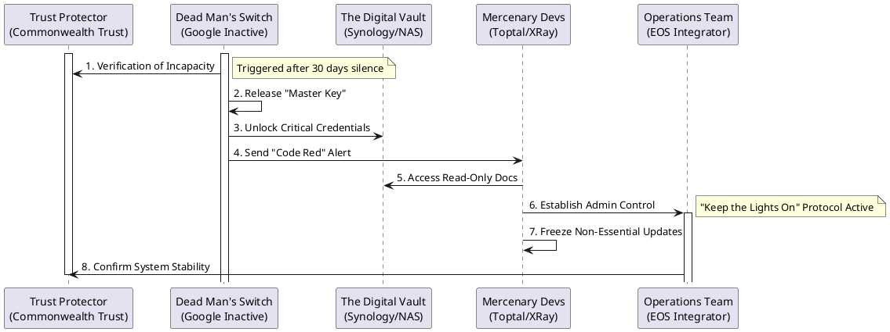
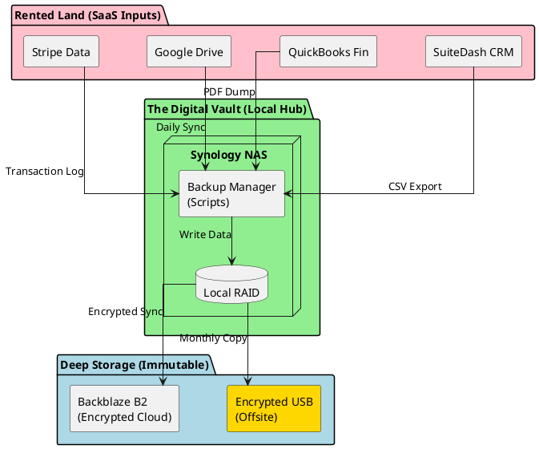
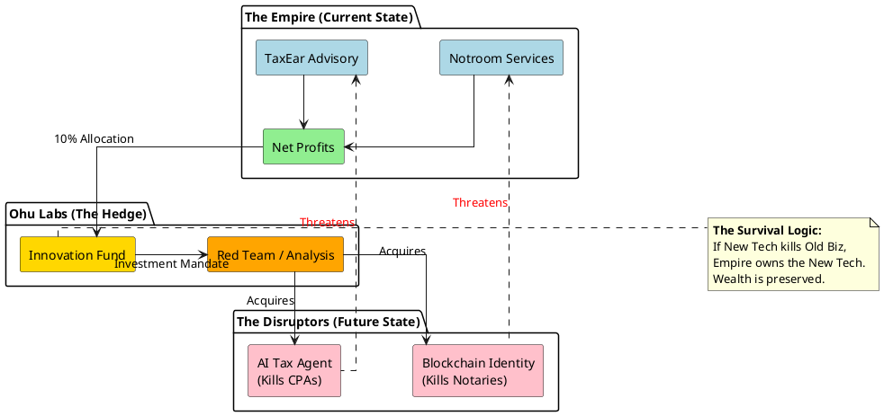
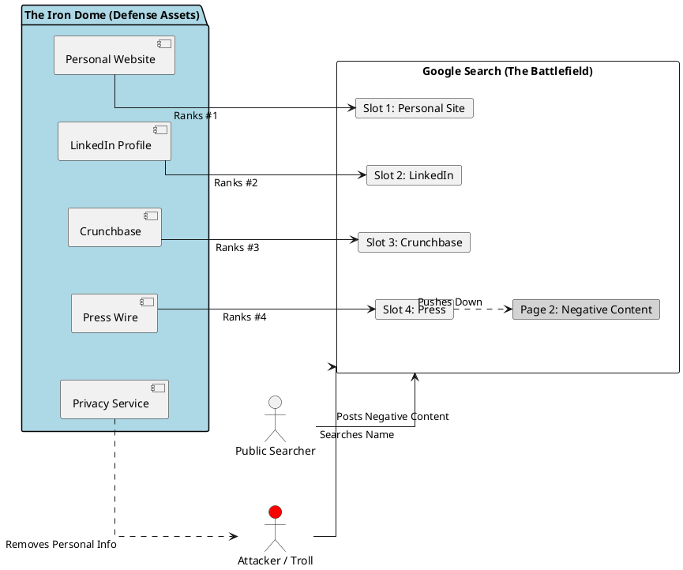
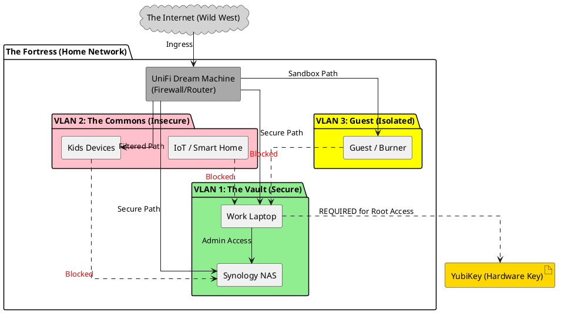

# The Fortress Protocols
## Existential Risk Mitigation & The "Blind Spots" of Empire
### A Special Supplement to The Legacy Codex

**By Ikechukwu Ohu**

---

## Introduction: The Physics of Entropy

We have built a Fortress of legal structures, a Machine for revenue, and a Shield of insurance. However, looking at the system as a *living organism* that must survive 365 years, there are **five critical "Blind Spots"** that traditional business planning often overlooks.

These threats do not come from the market, the IRS, or competitors. They come from **entropy, dependency, and physics.**

This manuscript details the specific protocols to neutralize these existential risks. It is the "Survival Manual" for the scenarios that standard operating procedures assume will never happen.

---

## Protocol 1: Technological Succession (The "Bus Factor" Fix)

**The Risk:**
The Empire runs on a highly automated "Machine" (SuiteDash, Zapier, AI Agents). Currently, this system likely exists inside *your* head. If you were incapacitated today, the Trust would have money, but the **operations might grind to a halt** because no one else knows how to fix a broken API connection, debug a failed Zap, or access the 2FA-gated admin panels.

**The Solution:** The "Code Red" Technical Continuity Plan.

### 1.1 The "Code Red" Manual
This is *not* a technical documentation for developers. It is a "In Case of Emergency" guide for your spouse or non-technical Trustee.

*   **Location:** Physical binder in the fireproof safe + Digital copy in the "Digital Vault" (see Protocol 2).
*   **Content:**
    *   **The "Kill Switch" List:** How to immediately stop specific automations if they go haywire (e.g., "If the billing bot starts charging clients 100x, log in here and toggle this switch").
    *   **The "Master Key" Access:** Instructions on how to access the Password Manager (e.g., 1Password/Bitwarden) which holds all other keys. This master password should be split (Shamir's Secret Sharing) or held by the Trust Protector.
    *   **The "Keep the Lights On" Bill List:** A list of critical infrastructure payments (Domain Names, Hosting, Zapier, SuiteDash) that *must* be paid to prevent total system deletion.

### 1.2 The "Mercenary" Retainer
You cannot expect your spouse to learn API coding during a crisis. You need a pre-vetted specialist.

*   **The Strategy:** Identify 2-3 "Mercenary" automation experts (freelancers or agencies) who are *Institutional Grade*.
*   **Recommended Resources:**
    *   **For SuiteDash/CRM:** **SuiteDash Certified Super Solvers** or **The Automation Agency**.
    *   **For API/Zapier:** **Toptal Enterprise** (for immediate senior engineering talent) or **XRay.Tech**.
*   **The Setup:**
    *   Pay them for a small "audit" project once a year so they know your system architecture.
    *   Grant them "Read-Only" or "Developer" access to your documentation.
    *   **The Trigger:** In the event of your incapacity, the Trustee is authorized to immediately engage one of these Mercenaries on a high-priority retainer to maintain system stability.

### 1.3 The Operational Continuity Team
*   **The Trust Protector:** Use an institutional corporate trustee like **Commonwealth Trust Company** or **Peak Trust Company** to ensure the "Code Red" is legally enforced.
*   **The Key Operator:** Retain a "Fractional Integrator" firm from the **EOS Network** to serve as interim GM.

### 1.4 Visualization: The Code Red Activation Sequence

---

## Protocol 2: Data Sovereignty (The Digital Vault)

**The Risk:**
The Empire runs on "Rented Land" (SaaS). SuiteDash, Google, Stripe, and OpenAI are private companies. They can ban accounts, change pricing, or delete data overnight. A "Terms of Service" violation could freeze your cash flow and erase your client history.

**The Solution:** A "Digital Bug-Out Bag" that ensures you own your data, physically.

### 2.1 The Digital Vault Architecture

We utilize the **3-2-1 Backup Rule** adapted for the SaaS era:
*   **3** Copies of Data (Production, Local, Offsite).
*   **2** Different Media Types (Cloud SaaS, Physical Disk).
*   **1** Copy Offsite/Offline (Immutable).

**The Stack:**
1.  **Local Hub (The Fortress):** A Synology NAS (Network Attached Storage) located in your secure home office.
    *   *Function:* Runs active backup scripts to pull data *down* from the cloud.
2.  **The Aggregator:** A dedicated "Backup Server" (can be a VM on the NAS) running scripts to export CSVs/PDFs.
3.  **The Cold Storage:** An encrypted external Hard Drive connected to the NAS, rotated monthly to a physical safe deposit box.

### 2.2 Automated Extraction Scripts
*   **Financials:** Script connects to QuickBooks/Stripe API -> Downloads all Invoices, P&L, Balance Sheets as PDFs -> Stores in `/Financials/YYYY-MM/`.
*   **Client Data:** Script connects to SuiteDash -> Exports full Client CSV (Contacts, Custom Fields) -> Stores in `/CRM_Snapshots/`.
*   **Communications:** "Google Takeout" or IMAP backup of all email accounts to local archive.

### 2.3 Visualization: The Digital Vault Diagram

---

## Protocol 3: The "Ohu Labs" (Anti-Obsolescence)

**The Risk:**
The core engines (Notary, Tax, Directory) are high-risk for AI displacement in the next 10 years. If the Empire focuses solely on *optimizing* these, it might optimize itself into extinction (The "Kodak Moment").

**The Solution:** Institutionalized Self-Cannibalization.

### 3.1 The "Kill Switch" Investment Thesis
*   **The Mandate:** The Family Council must allocate **5-10% of Net Profits** specifically to investments or R&D that *threaten* the current business model.
*   **The Logic:** You must own the thing that kills you. If AI replaces Notaries, you should own shares in the AI Notary platform.

### 3.2 Allocation Strategy
*   **If owning Notroom Services:** Invest in Blockchain Identity & Smart Contract startups.
*   **If owning TaxEar Advisory:** Invest in AI-driven automated tax filing software.
*   **If owning Directories:** Invest in LLM-based Search Agents (Perplexity, etc.) or build your own "Answer Engine" wrapper.

### 3.3 The "Red Team" Exercise
*   **Annual Ritual:** During the Annual Strategic Retreat, one family member is assigned the role of "The Disruptor."
*   **The Task:** Create a pitch deck for a competitor designed specifically to put the Ohu Empire out of business within 24 months.
*   **The Result:** The Family Council uses this deck to identify weak points and pivot strategy.

### 3.4 Visualization: The Innovation Cycle (The Hedge)

---

## Protocol 4: The Reputation Iron Dome

**The Risk:**
We have Cyber Liability (data breach) and D&O (lawsuits). But what about a coordinated **reputation attack**, "Cancel Culture" event, or Deepfake attack? In the digital age, a false narrative can destroy "Social Capital" faster than a lawsuit.

**The Solution:** Proactive Reputation Defense.

### 4.1 SEO "Iron Dome"
You cannot delete negative content, but you can bury it.
*   **Strategy:** Own the first 2 pages of Google results for "Ikechukwu Ohu," "Judith Ohu," and all Entity names.
*   **Tactics:**
    *   Create profiles on high-authority sites (LinkedIn, Crunchbase, Medium, About.me).
    *   Publish press releases about boring, positive news (e.g., "PNR Holdings announces charity drive").
    *   Maintain a personal website that acts as the "canonical" source of truth.

### 4.2 Dark Web & Social Monitoring
*   **Tools:** Use services (like DeleteMe, Optery, or specialized monitoring) to scan for:
    *   Home address leaks (Doxing risk).
    *   Password dumps associated with family emails.
    *   Impersonator accounts on social media.

### 4.3 The "Crisis Comms" Retainer
*   **Preparation:** Have a relationship with a boutique Crisis PR firm. You don't pay a monthly retainer, but you have their cell number and a pre-signed NDA.
*   **Protocol:** If a reputation crisis hits, the family does **not** respond publicly. They call the pro. "No comment" is often better than a defensive comment.

### 4.4 Visualization: The Reputation Iron Dome

---

## Protocol 5: Physical & Operational Security (OpSec)

**The Risk:**
We focus on software security, but the weakest link is often physical hardware or "social engineering" of family members. A compromised laptop or a SIM-swap attack on a phone can bypass all digital firewalls.

**The Solution:** Military-Grade Hygiene.

### 5.1 Hardware Hardening
*   **YubiKeys (Hardware 2FA):** Mandate hardware keys for *all* "Root" accounts:
    *   Google Workspace Admin.
    *   Domain Registrars (GoDaddy/Cloudflare) - *If you lose your domains, you lose the business.*
    *   Primary Bank Accounts.
    *   Password Manager Master Account.
*   **Why:** SMS 2FA is easily spoofed via SIM Swapping. Authenticator apps are phishing-prone. Hardware keys are near-invincible remotely.

### 5.2 Network Segregation
*   **Home Network:** Use a Prosumer Router (Ubiquiti/UniFi).
*   **VLAN 1 (The Vault):** Only for business laptops/servers. Highly restricted.
*   **VLAN 2 (The Commons):** For Kids' iPads, Smart TVs, Gaming Consoles. These devices are notoriously insecure.
*   **VLAN 3 (Guest):** For visitors. Isolated from everything.

### 5.3 The "Clean" Travel Protocol
*   **Risk:** Crossing borders (customs searches) or using hotel Wi-Fi.
*   **Protocol:**
    *   Use "Burner" or "Travel" laptops/phones for international travel.
    *   These devices contain **NO** local data. They connect via VPN to the cloud.
    *   If seized or stolen, the loss is hardware only, not the Empire's keys.

### 5.4 Visualization: The OpSec Network Map

---

## Conclusion: The Paranoia of the Prudent

Implementing these protocols may seem excessive. It is. But you are not building a lemonade stand; you are building a 365-year institution.

**Paranoia is a feature, not a bug.**

By addressing these "Blind Spots" now, you ensure that the Empire can survive the death of its founder, the bankruptcy of its vendors, the disruption of its industry, and the malice of its enemies.

**Action Items:**
1.  [ ] Purchase Synology NAS and External Drives for the Digital Vault.
2.  [ ] Order 4x YubiKeys (2 for Primary, 2 for Spouse/Backup).
3.  [ ] Schedule the first "Code Red" documentation session.
4.  [ ] Add "Ohu Labs" allocation to the next Capital Allocation meeting.

---
**END OF MANUSCRIPT**

