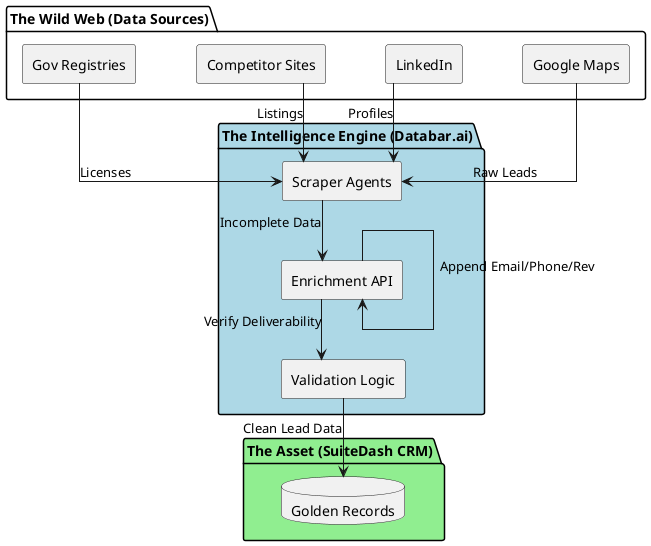
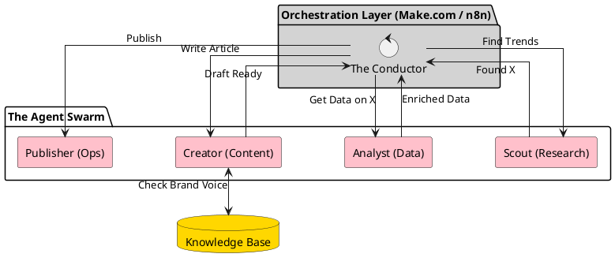
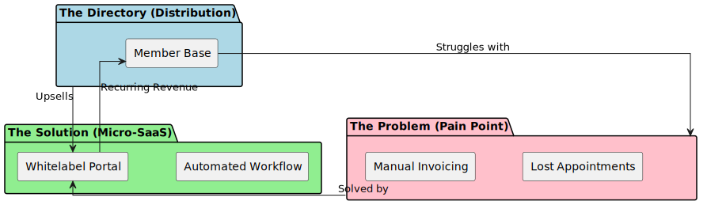
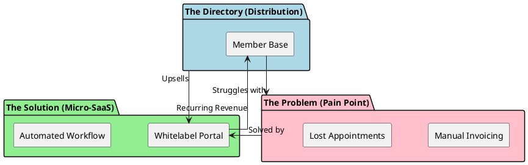

# Volume III: The Digital Ecosystem
## The Directory Empire, Intelligence Layer, and SaaS Factory

**By Ikechukwu Ohu**

---

## Introduction to Volume III

We have built the Legal Fortress (Volume II) and the Operational Machine (Volume IV/Book 3). Now, we build the **Assets** that feed them.

Volume III addresses the "Digital Real Estate" gap. In the modern economy, owning the *infrastructure* of connection (Directories), the *flow* of data (Intelligence Layer), and the *tools* of leverage (SaaS) is equivalent to owning land, oil, and steel in the 20th century.

This Volume details the strategy for building the **Directory Empire**, the **Databar.ai Intelligence Layer**, and the **AI ∞ OS** that powers them.

---

# Chapter 13: Directory Selection & Development

## 13.1 The Philosophy of Digital Landlords

We do not build "websites." We build **Digital Real Estate**. A Directory is a piece of land where buyers and sellers congregate. We own the land, we charge the toll, and we control the data.

### The 3 Pillars of a Profitable Directory
1.  **High-Value Transactions**: The niche must involve expensive problems (e.g., "Emergency Plumber" vs "Knitting Circle").
2.  **Fragmented Supply**: There must be thousands of small providers who need help being found (e.g., Notaries, Tutors, Trades).
3.  **Urgent Demand**: The customer needs the solution *now*.

## 13.2 The Niche Selection Matrix

We use the **Databar.ai Intelligence Layer** to validate niches before writing a line of code.

| Criteria | Score (1-10) | Weight | Weighted Score |
| :--- | :--- | :--- | :--- |
| **CPC (Cost Per Click)** | High CPC = High Value | 30% | |
| **Search Volume** | >10k/mo is ideal | 20% | |
| **fragmentation** | Many small businesses? | 25% | |
| **Recurring Need** | Do they need it often? | 15% | |
| **Tech Lag** | Are competitors old/slow? | 10% | |

**Target Niches for Ohu Empire:**
1.  **Notary Services** (Existing Strength)
2.  **Estate Planning Attorneys** (High Value, aligns with Trust focus)
3.  **Expat Services (Nigeria <-> US)** (Bridge Strategy)
4.  **Vocational Training** (Aligns with Origin Eyes)

## 13.3 The "Programmatic SEO" Launch Strategy

We do not write articles one by one. We use **AI ∞ OS** to generate thousands of "Programmatic Pages" instantly.

**The Architecture:**
*   **Database**: Airtable / Databar.ai (The Source of Truth)
*   **CMS**: WordPress + WP All Import OR Softr (The Display)
*   **Content Engine**: OpenAI API (The Writer)

**The "City Page" Formula:**
*   `[Service] in [City], [State]`
*   *Example:* "Mobile Notary in Austin, Texas"
*   **Scale:** 50 States x 100 Cities = 5,000 Landing Pages on Day 1.

---

# Chapter 14: Directory Monetization Mastery

## 14.1 The Monetization Ladder

We do not rely on ads. We rely on **Value Exchange**.

### Rung 1: The "Claim" Model (Freemium)
*   **Offer:** Free basic listing (Name, Phone).
*   **Goal:** Get the business owner to "Claim" their profile to update info.
*   **Data Capture:** Validated email/phone for our CRM.

### Rung 2: The "Verified" Model ($29-$99/mo)
*   **Offer:** "Verified Badge," Website Link, Photos, "Request a Quote" button.
*   **Value:** Trust signal + Lead generation.

### Rung 3: The "Lead Gen" Model (Pay Per Lead)
*   **Offer:** We sell the *phone call* or *form fill*.
*   **Price:** $25-$100 per exclusive lead.
*   **Mechanism:** Twilio Call Tracking + SuiteDash Forms.

### Rung 4: The "SaaS" Model (Micro-SaaS)
*   **Offer:** We give them the tools to run their business (Invoicing, Scheduling, CRM).
*   **Product:** Whitelabeled SuiteDash Sub-Account.
*   **Price:** $199/mo (High retention).

---

# Chapter 15: The Intelligence Layer (Databar.ai)

## 15.1 The Data Enrichment Architecture

We do not guess. We **enrich**. The Intelligence Layer automates the gathering of competitive intelligence and lead data.

### The Databar.ai Workflow
1.  **Scrape**: Monitor Competitor Directories (YellowPages, Yelp, Niche sites).
2.  **Enrich**: Use Databar.ai API to append Emails, LinkedIn Profiles, and Revenue Estimates.
3.  **Sync**: Push enriched data to SuiteDash CRM.
4.  **Act**: Trigger "Cold Outreach" Sequence via SendGrid.

### Visualization: The Intelligence Layer

---

# Chapter 15.5: The AI ∞ OS (Multi-Agent Orchestration)

## 15.5.1 The Concept
We are moving from "Tools" (ChatGTP) to "Agents" (AI Employees). The **AI ∞ OS** is the operating system where multiple AI agents collaborate to execute complex tasks without human intervention.

## 15.5.2 The Agent Roster
*   **Agent 1 (Scout):** Monitors news/trends (Perplexity API).
*   **Agent 2 (Analyst):** Enriches data (Databar.ai).
*   **Agent 3 (Creator):** Writes content (OpenAI/Claude).
*   **Agent 4 (Publisher):** Posts to WordPress/Socials.
*   **Agent 5 (Support):** Answers Level 1 queries (Intercom/Chatbase).

### Visualization: The AI ∞ OS Architecture

---

# Chapter 15.6: The SaaS Factory (Micro-SaaS Strategy)

## 15.6.1 The "Unbundling" Strategy
We do not compete with Salesforce. We "unbundle" specific features for specific niches.

**The Formula:**
1.  Identify a painful, repetitive workflow in a Directory Niche (e.g., "Notary Invoicing").
2.  Build a simple wrapper around that workflow using **SuiteDash Portal** or **Bubble**.
3.  Sell it to the Directory members as an add-on.

## 15.6.2 The SuiteDash SaaS Model
*   **Product:** "The Notary Command Center"
*   **Features:** Invoicing, Scheduling, CRM.
*   **Tech Stack:** SuiteDash Whitelabel.
*   **Cost to Build:** $0 (Config only).
*   **Price:** $49/mo.
*   **Margin:** ~90%.

### Visualization: The SaaS Factory

---

## Action Plan for Volume III

### Phase 1: Intelligence (Days 1-30)
1.  Set up **Databar.ai** account.
2.  Configure "Competitor Watch" scrapers.
3.  Select first 3 niches using the Selection Matrix.

### Phase 2: Infrastructure (Days 31-60)
1.  Launch 3 "MVP" Directory sites (WordPress + Directory Theme).
2.  Populate with 1,000+ programmatic pages each.
3.  Activate **AI ∞ OS** for daily content blog posts.

### Phase 3: Monetization (Days 61-90)
1.  Launch "Claim Your Listing" email campaign (using enriched data).
2.  Offer "Verified Badge" for $29/mo.
3.  Upsell "Micro-SaaS" toolkit to top 10% of users.

---

**End of Volume III**

